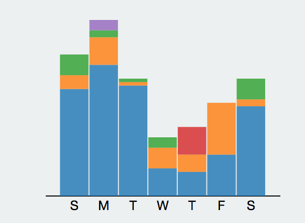
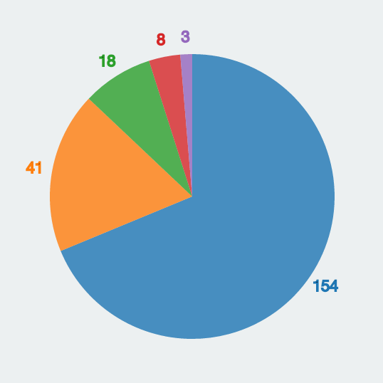
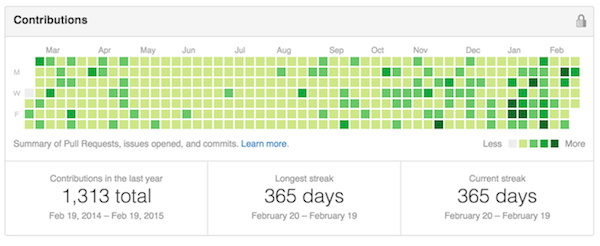
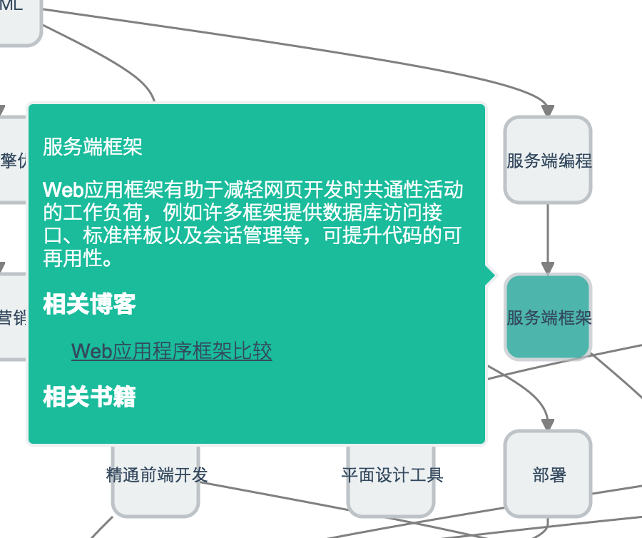
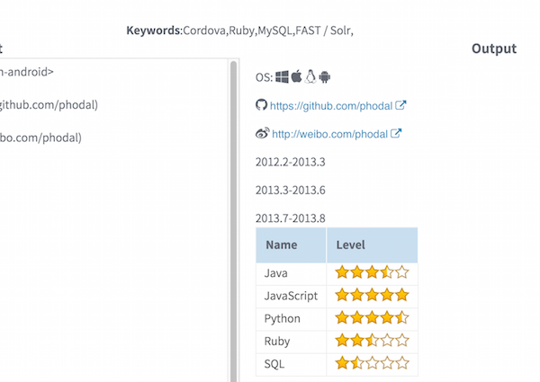
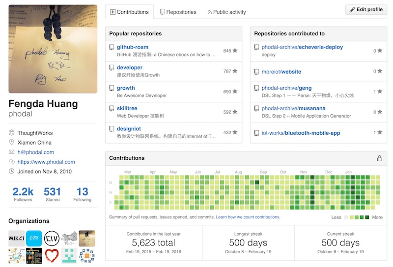
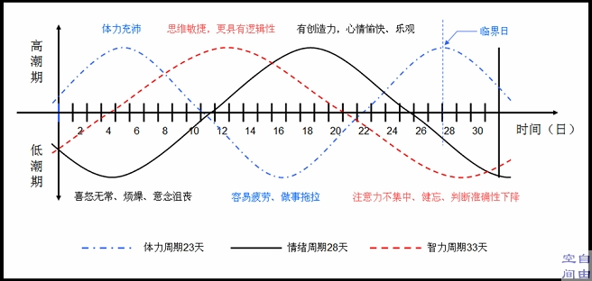
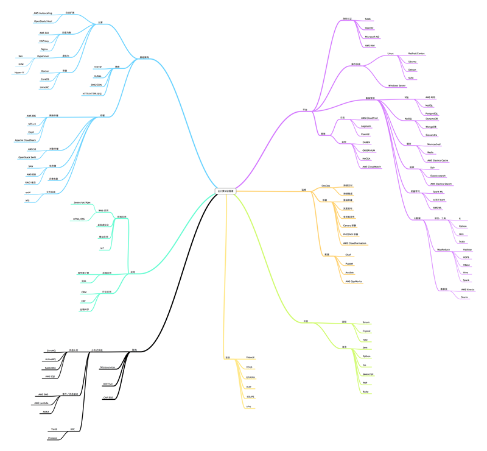
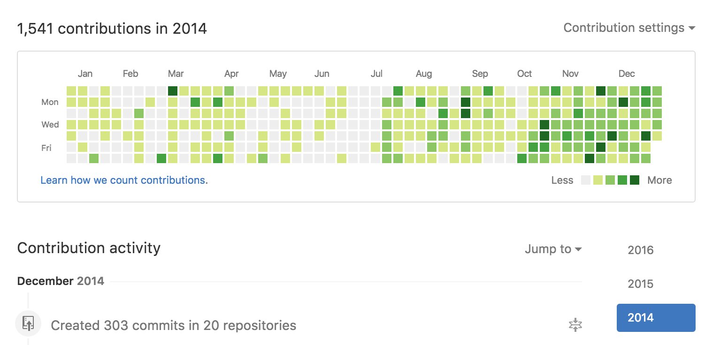
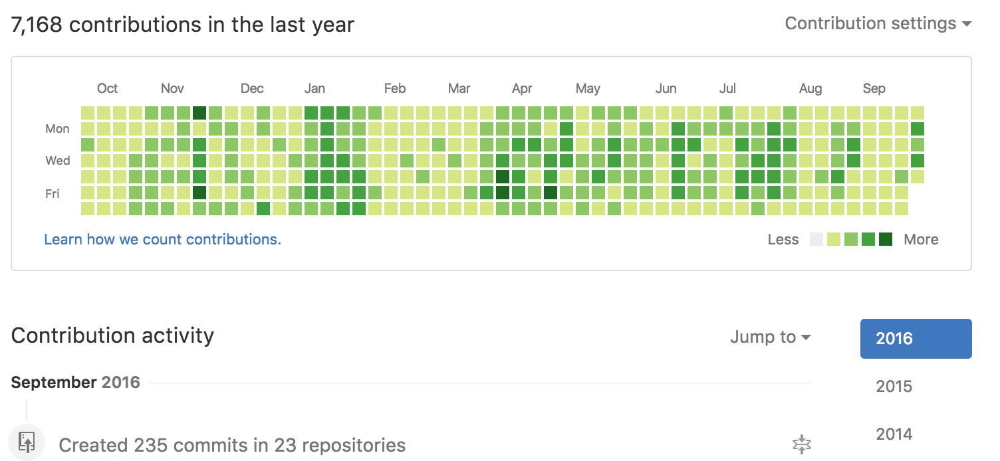

#前言

我的GitHub主页上写着加入的时间——``Joined on Nov 8, 2010``，那时才大一，在那之后的那长日子里我都没有过到。也许是因为我学的不是计算机，到了今天——``2015.3.9``，我也发现这其实是程序员的社交网站。

过去，曾经有很长的一些时间我试过在GitHub上连击，也试着去了解别人是如何用好这个工具的。当然粉丝在GitHub上也是很重要的。

在这里，我会试着将我在GitHub上学到的东西一一分享出来。

##我与GitHub的故事

在我大四找工作的时候，试图去寻找一份硬件、物联网相关的工作(ps: 专业是电子信息工程)。尽管简历上写得满满的各种经历、经验，然而并没有卵用。跑了几场校园招聘会后，十份简历(ps: 事先已经有心里准备)一个也没有投出去——因为学校直接被拒。我对霸面什么的一点兴趣都没有，千里马需要伯乐。后来，我加入了Martin Flower所在的公司，当然这是后话了。

这是一个残酷的世界，在学生时代，如果你长得不帅不高的话，那么多数的附加技能都是白搭(ps: 通常富的是看不到这篇文章的)。在工作时期，如果你上家没有名气，那么将会影响你下一份工作的待遇。而，很多东西却会改变这些，GitHub就是其中一个。

注册GitHub的时候大概是大一的时候，我熟悉的时候已经是大四了，现在已经毕业一年了。在过去的近两年里，我试着以几个维度在GitHub上创建项目:

1. 快速上手框架来实战，即demo
2. 重构别人的代码
3. 创建自己可用的框架
4. 快速构建大型应用
5. 构建通用的框架

###GitHub与收获

先说说**与技能无关的收获**吧，毕业设计做的是一个《[最小物联网系统](https://github.com/phodal/iot)》，考虑到我们专业老师没有这方面知识，答辩时会带来问题，尽量往这方面靠拢。当我毕业后，这个项目已经有过百个star了，这样易上手的东西还是比较受欢迎的(ps: 不过这种硬件相关的项目通常受限于GitHub上硬件开发工程师比较少的困扰)。

毕业后一个月收到PACKT出版社的邮件(ps: 他们是在github上找到我的)，内容是关于Review一本[物联网](iot)书籍，即在《[从Review到翻译IT书籍](http://www.phodal.com/blog/review-it-books-with-translate-book/)》中提到的《Learning Internet of Things》。作为一个四级没过的"物联网专家"，去审阅一本英文的物联网书籍。。。

当然，后来是审阅完了，书上有我的英文简介。


一个月前，收到MANNING出版社的邮件(ps: 也是在github上)，关于Review一本[物联网](iot)书籍的目录，并提出建议。

也因此带来了其他更多的东西，当然不是这里的主题。在这里，我们就不讨论各种骚扰邮件，或者中文合作。从没有想象过，我也可以在英语世界有一片小天地。

这些告诉我们，GitHub上找一个你擅长的主题，那么会有很多人找上你的。

###GitHub与成长

过去写过一篇《[如何通过github提升自己](http://www.phodal.com/blog/use-github-grow-self/)》的文章，现在只想说三点:

1. 测试
2. 更多的测试
3. 更多的、更多的、更多的测试

没有测试的项目是很扯淡的，除非你的项目只有一个函数，然后那个函数返回``Hello,World``。

如果你的项目代码有上千行，如果你能保证测试覆盖率可以达到95%以的话，那么我想你的项目不会有太复杂的函数。假使有这样的函数，那么他也是被测试覆盖住的。

如果你在用心做这个项目，那么你看到代码写得不好也会试着改进，即重构。当有了一些，你的技能会不断提升。你开始会试着接触更多的东西，如stub，如mock，如fakeserver。

有一天，你会发现你离不开测试。

然后就会相信: **那些没有写测试的项目都是在耍流氓**

##为什么你应该深入GitHub

上面我们说的都是我们可以收获到的东西，我们开始尝试就意味着我们知道它可能给我们带来好处。上面已经提到很多可以提升自己的例子了，这里再说说其他的。

###方便工作

我们可以从中获取到不同的知识、内容、信息。每个人都可以从别人的代码中学习，当我们需要构建一个库的时候我们可以在上面寻找不同的库和代码来实现我们的功能。如当我在实现一个库的时候，我会在GitHub上到相应的组件:

- Promise 支持
- Class类(ps:没有一个好的类使用的方式)
- Template 一个简单的模板引擎
- Router 用来控制页面的路由
- Ajax 基本的Ajax Get/Post请求

###获得一份工作

越来越多的人因为GitHub获得工作，因为他们的做的东西正好符合一些公司的要求。那么，这些公司在寻找代码的时候，就会试着邀请他们。

因而，在GitHub寻找合适的候选人，已经是一种趋势。

###扩大交际

如果我们想创造出更好、强大地框架时，那么认识更多的人可能会带来更多的帮助。有时候会同上面那一点一样的效果 

---

#Git基本知识与GitHub使用

##Git

从一般开发者的角度来看，git有以下功能：

1. 从服务器上克隆数据库（包括代码和版本信息）到单机上。
2. 在自己的机器上创建分支，修改代码。
3. 在单机上自己创建的分支上提交代码。
4. 在单机上合并分支。
5. 新建一个分支，把服务器上最新版的代码fetch下来，然后跟自己的主分支合并。
6. 生成补丁（patch），把补丁发送给主开发者。
7. 看主开发者的反馈，如果主开发者发现两个一般开发者之间有冲突（他们之间可以合作解决的冲突），就会要求他们先解决冲突，然后再由其中一个人提交。如果主开发者可以自己解决，或者没有冲突，就通过。
8. 一般开发者之间解决冲突的方法，开发者之间可以使用pull 命令解决冲突，解决完冲突之后再向主开发者提交补丁。

从主开发者的角度（假设主开发者不用开发代码）看，git有以下功能：

1. 查看邮件或者通过其它方式查看一般开发者的提交状态。
2. 打上补丁，解决冲突（可以自己解决，也可以要求开发者之间解决以后再重新提交，如果是开源项目，还要决定哪些补丁有用，哪些不用）。
3. 向公共服务器提交结果，然后通知所有开发人员。

###Git初入

如果是第一次使用Git，你需要设置署名和邮箱：

```
$ git config --global user.name "用户名"
$ git config --global user.email "电子邮箱"
```

将代码仓库clone到本地，其实就是将代码复制到你的机器里，并交由Git来管理：

```
$ git clone git@github.com:someone/symfony-docs-chs.git
```
    
你可以修改复制到本地的代码了（symfony-docs-chs项目里都是rst格式的文档）。当你觉得完成了一定的工作量，想做个阶段性的提交：

向这个本地的代码仓库添加当前目录的所有改动：

```
$ git add .
```
    
或者只是添加某个文件：

```
$ git add -p
````

我们可以输入

```
$git status
```

来看现在的状态，如下图是添加之前的：


下面是添加之后 的


可以看到状态的变化是从黄色到绿色，即unstage到add。


##GitHub

Wiki百科上是这么说的

> GitHub 是一个共享虚拟主机服务，用于存放使用Git版本控制的软件代码和内容项目。它由GitHub公司（曾称Logical Awesome）的开发者Chris Wanstrath、PJ Hyett和Tom Preston-Werner
使用Ruby on Rails编写而成。

当然让我们看看官方的介绍:

> GitHub is the best place to share code with friends, co-workers, classmates, and complete strangers. Over eight million people use GitHub to build amazing things together.


它还是什么?

- 网站
- 免费博客
- 管理配置文件
- 收集资料
- 简历
- 管理代码片段
- 托管编程环境
- 写作

等等。看上去像是大餐，但是你还需要了解点什么?

###版本管理与软件部署

jQuery[^jQuery]在发布版本``2.1.3``，一共有152个commit。我们可以看到如下的提交信息:

 - Ajax: Always use script injection in globalEval …	 bbdfbb4
 - Effects: Reintroduce use of requestAnimationFrame …	 72119e0
 - Effects: Improve raf logic …	 708764f
 - Build: Move test to appropriate module	 fbdbb6f
 - Build: Update commitplease dev dependency
 - ...

###GitHub与Git

> Git是一个分布式的版本控制系统，最初由Linus Torvalds编写，用作Linux内核代码的管理。在推出后，Git在其它项目中也取得了很大成功，尤其是在Ruby社区中。目前，包括Rubinius、Merb和Bitcoin在内的很多知名项目都使用了Git。Git同样可以被诸如Capistrano和Vlad the Deployer这样的部署工具所使用。

> GitHub可以托管各种git库，并提供一个web界面，但与其它像 SourceForge或Google Code这样的服务不同，GitHub的独特卖点在于从另外一个项目进行分支的简易性。为一个项目贡献代码非常简单：首先点击项目站点的“fork”的按钮，然后将代码检出并将修改加入到刚才分出的代码库中，最后通过内建的“pull request”机制向项目负责人申请代码合并。已经有人将GitHub称为代码玩家的MySpace。

###在GitHub创建项目

接着,我们试试在上面创建一个项目:


就会有下面的提醒:


它提供多种方式的创建方法:

> …or create a new repository on the command line

```
echo "# github-roam" >> README.md
git init
git add README.md
git commit -m "first commit"
git remote add origin git@github.com:phodal/github-roam.git
git push -u origin master
```
	
> …or push an existing repository from the command line

```
git remote add origin git@github.com:phodal/github-roam.git
git push -u origin master
```		
	
如果你完成了上面的步骤之后,那么我想你想知道你需要怎样的项目。

##GitHub流行项目分析

之前曾经分析过一些GitHub的用户行为，现在我们先来说说GitHub上的Star吧。(截止: 2015年3月9日23时。)

用户  | 项目名    | Language | Star | Url
-----|---------- |----------|------|----
twbs | Bootstrap | CSS      | 78490 | [https://github.com/twbs/bootstrap](https://github.com/twbs/bootstrap)
vhf |free-programming books | - | 37240 | [https://github.com/vhf/free-programming-books](https://github.com/vhf/free-programming-books)
angular | angular.js | JavaScript | 36,061 | [https://github.com/angular/angular.js](https://github.com/angular/angular.js)
mbostock | d3 | JavaScript | 35,257 | [https://github.com/mbostock/d3](https://github.com/mbostock/d3)
joyent | node | JavaScript | 35,077 | [https://github.com/joyent/node](https://github.com/joyent/node)

上面列出来的是前5的，看看大于1万个stars的项目的分布，一共有82个:

语言 | 项目数
-----|-----
JavaScript | 37
Ruby | 6 
CSS | 6 
Python | 4 
HTML | 3 
C++ | 3 
VimL | 2 
Shell | 2 
Go | 2 
C | 2 

类型分布:


 - 库和框架: 如``jQuery`` 
 - 系统: 如``Linux``、``hhvm``、``docker``
 - 配置集: 如``dotfiles``
 - 辅助工具: 如``oh-my-zsh``
 - 工具: 如``Homewbrew``和``Bower``
 - 资料收集: 如``free programming books``，``You-Dont-Know-JS``，``Font-Awesome``
 - 其他:简历如``Resume``
 
##Pull Request

除了创建项目之外，我们也可以创建Pull Request来做贡献。

###我的第一个PR

我的第一个PR是给一个小的Node的CoAP相关的库的Pull Request。原因比较简单，是因为它的README.md写错了，导致我无法办法进行下一步。

		 const dgram       = require('dgram')
		-    , coapPacket  = require('coap-packet')
		+    , package     = require('coap-packet')

很简单，却又很有用的步骤，另外一个也是：

```
 else
   cat << END
 $0: error: module ngx_pagespeed requires the pagespeed optimization library.
-Look in obj/autoconf.err for more details.
+Look in objs/autoconf.err for more details.
 END
   exit 1
 fi
``` 

###CLA

CLA即Contributor License Agreement，在为一些大的组织、机构提交Pull Request的时候，可能需要签署这个协议。他们会在你的Pull Request里问你，只有你到他们的网站去注册并同意协议才会接受你的PR。

以下是我为Google提交的一个PR


以及Eclipse的一个PR


他们都要求我签署CLA。

 <hr>

#构建GitHub项目

##如何用好GitHub

如何用好GitHub,并实践一些敏捷软件开发是一个很有意思的事情.我们可以在上面做很多事情,从测试到CI,再到自动部署.

###敏捷软件开发

显然我是在扯淡，这和敏捷软件开发没有什么关系。不过我也不知道瀑布流是怎样的。说说我所知道的一个项目的组成吧:

 - 看板式管理应用程序(如trello，简单地说就是管理软件功能)
 - CI(持续集成)
 - 测试覆盖率
 - 代码质量(code smell)
 
对于一个不是远程的团队(如只有一个人的项目) 来说，Trello、Jenkin、Jira不是必需的:

> 你存在，我深深的脑海里

当只有一个人的时候，你只需要明确知道自己想要什么就够了。我们还需要的是CI、测试，以来提升代码的质量。

###测试

通常我们都会找Document，如果没有的话，你会找什么?看源代码，还是看测试?

```javascript
it("specifying response when you need it", function (done) {
	var doneFn = jasmine.createSpy("success");

	lettuce.get('/some/cool/url', function (result) {
		expect(result).toEqual("awesome response");
		done();
	});

	expect(jasmine.Ajax.requests.mostRecent().url).toBe('/some/cool/url');
	expect(doneFn).not.toHaveBeenCalled();

	jasmine.Ajax.requests.mostRecent().respondWith({
		"status": 200,
		"contentType": 'text/plain',
		"responseText": 'awesome response'
	});
});
```

代码来源: [https://github.com/phodal/lettuce](https://github.com/phodal/lettuce)

上面的测试用例，清清楚楚地写明了用法，虽然写得有点扯。

等等，测试是用来干什么的。那么，先说说我为什么会想去写测试吧:

 - 我不希望每次做完一个个新功能的时候，再手动地去测试一个个功能。(自动化测试)
 - 我不希望在重构的时候发现破坏了原来的功能，而我还一无所知。
 - 我不敢push代码，因为我没有把握。
 
虽然，我不是TDD的死忠，测试的目的是保证功能正常，TDD没法让我们写出质量更高的代码。但是有时TDD是不错的，可以让我们写出逻辑更简单地代码。

也许你已经知道了``Selenium``、``Jasmine``、``Cucumber``等等的框架，看到过类似于下面的测试

```
 Ajax
   ✓ specifying response when you need it
   ✓ specifying html when you need it
   ✓ should be post to some where
 Class
   ✓ respects instanceof
   ✓ inherits methods (also super)
   ✓ extend methods
 Effect
   ✓ should be able fadein elements
   ✓ should be able fadeout elements
```

代码来源: [https://github.com/phodal/lettuce](https://github.com/phodal/lettuce)
	   
看上去似乎每个测试都很小，不过补完每一个测试之后我们就得到了测试覆盖率

File | Statements | Branches | Functions | Lines
-----|------------|----------|-----------|------
lettuce.js	| 98.58% (209 / 212)| 82.98%(78 / 94) | 100.00% (54 / 54) | 98.58% (209 / 212)

本地测试都通过了，于是我们添加了``Travis-CI``来跑我们的测试

###CI

虽然node.js不算是一门语言，但是因为我们用的node，下面的是一个简单的``.travis.yml``示例:

```yml
language: node_js
node_js:
	- "0.10"

notifications:
	email: false

before_install: npm install -g grunt-cli
install: npm install
after_success: CODECLIMATE_REPO_TOKEN=321480822fc37deb0de70a11931b4cb6a2a3cc411680e8f4569936ac8ffbb0ab codeclimate < coverage/lcov.info
```

代码来源: [https://github.com/phodal/lettuce](https://github.com/phodal/lettuce)

我们把这些集成到``README.md``之后，就有了之前那张图。

CI对于一个开发者在不同城市开发同一项目上来说是很重要的，这意味着当你添加的部分功能有测试覆盖的时候，项目代码会更加强壮。

###代码质量

像``jslint``这类的工具，只能保证代码在语法上是正确的，但是不能保证你写了一堆bad smell的代码。

 - 重复代码
 - 过长的函数
 - 等等
 
``Code Climate``是一个与github集成的工具，我们不仅仅可以看到测试覆盖率，还有代码质量。

先看看上面的ajax类:

```javascript
Lettuce.get = function (url, callback) {
	Lettuce.send(url, 'GET', callback);
};

Lettuce.send = function (url, method, callback, data) {
	data = data || null;
	var request = new XMLHttpRequest();
	if (callback instanceof Function) {
		request.onreadystatechange = function () {
			if (request.readyState === 4 && (request.status === 200 || request.status === 0)) {
				callback(request.responseText);
			}
		};
	}
	request.open(method, url, true);
	if (data instanceof Object) {
		data = JSON.stringify(data);
		request.setRequestHeader('Content-Type', 'application/json');
	}
	request.setRequestHeader('X-Requested-With', 'XMLHttpRequest');
	request.send(data);
};
```

代码来源: [https://github.com/phodal/lettuce](https://github.com/phodal/lettuce)

在[Code Climate](https://codeclimate.com/github/phodal/lettuce/src/ajax.js)在出现了一堆问题

 - Missing "use strict" statement. (Line 2)
 - Missing "use strict" statement. (Line 14)
 - 'Lettuce' is not defined. (Line 5)

而这些都是小问题啦，有时可能会有

 - Similar code found in two :expression_statement nodes (mass = 86)

这就意味着我们可以对上面的代码进行重构，他们是重复的代码。

##模块分离与测试

在之前说到

> 奋斗了近半个月后，将fork的代码读懂、重构、升级版本、调整，添加新功能、添加测试、添加CI、添加分享之后，终于almost finish。

今天就来说说是怎样做的。

以之前造的[Lettuce](https://github.com/phodal/lettuce)为例，里面有:

 - 代码质量(Code Climate)
 - CI状态(Travis CI)
 - 测试覆盖率(96%)
 - 自动化测试(npm test)
 - 文档

按照[Web Developer路线图](https://github.com/phodal/awesome-developer)来说，我们还需要有:

 - 版本管理
 - 自动部署
 
等等。 

###代码模块化

在SkillTree的源码里，大致分为三部分:

 - namespace函数: 顾名思义
 - Calculator也就是TalentTree，主要负责解析、生成url，头像，依赖等等
 - Skill 主要是tips部分。
 
而这一些都在一个js里，对于一个库来说，是一件好事，但是对于一个项目来说，并非如此。 

依赖的库有

 - jQuery
 - Knockout
 
好在Knockout可以用Require.js进行管理，于是，使用了``Require.js``进行管理:

```html
<script type="text/javascript" data-main="app/scripts/main.js" src="app/lib/require.js"></script>
```

``main.js``配置如下:

```javascript
require.config({
  baseUrl: 'app',
  paths:{
    jquery: 'lib/jquery',
    json: 'lib/json',
    text: 'lib/text'
  }
});

require(['scripts/ko-bindings']);

require(['lib/knockout', 'scripts/TalentTree', 'json!data/web.json'], function(ko, TalentTree, TalentData) {
  'use strict';
  var vm = new TalentTree(TalentData);
  ko.applyBindings(vm);
});
```
	
text、json插件主要是用于处理web.json，即用json来处理技能，于是不同的类到了不同的js文件。

	.
	|____Book.js
	|____Doc.js
	|____ko-bindings.js
	|____Link.js
	|____main.js
	|____Skill.js
	|____TalentTree.js
	|____Utils.js
	
加上了后来的推荐阅读书籍等等。而Book和Link都是继承自Doc。

```javascript
define(['scripts/Doc'], function(Doc) {
  'use strict';
  function Book(_e) {
    Doc.apply(this, arguments);
  }
  Book.prototype = new Doc();

  return Book;
});	
```

而这里便是后面对其进行重构的内容。Doc类则是Skillock中类的一个缩影

```javascript
define([], function() {
  'use strict';
  var Doc = function (_e) {
    var e = _e || {};
    var self = this;

    self.label = e.label || (e.url || 'Learn more');
    self.url = e.url || 'javascript:void(0)';
  };

  return Doc;
});
```

或者说这是一个AMD的Class应该有的样子。考虑到this的隐性绑定，作者用了self=this来避免这个问题。最后Return了这个对象，我们在调用的就需要new一个。大部分在代码中返回的都是对象，除了在Utils类里面返回的是函数:

```javascript
return {
    getSkillsByHash: getSkillsByHash,
    getSkillById: getSkillById,				
    prettyJoin: prettyJoin
};
```
	
当然函数也是一个对象。	

###自动化测试

一直习惯用Travis CI，于是也继续用Travis Ci，``.travis.yml``配置如下所示:

```yml
language: node_js
node_js:
  - "0.10"

notifications:
  email: false

branches:
  only:
    - gh-pages
```

使用gh-pages的原因是，我们一push代码的时候，就可以自动测试、部署等等，好处一堆堆的。

接着我们需要在``package.json``里面添加脚本

```javascript
"scripts": {
    "test": "mocha"
  }
```
	  
这样当我们push代码的时候便会自动跑所有的测试。因为mocha的主要配置是用``mocha.opts``，所以我们还需要配置一下``mocha.opts``

	--reporter spec
	--ui bdd
	--growl
	--colors
	test/spec	  

最后的``test/spec``是指定测试的目录。

###Jshint

> JSLint定义了一组编码约定，这比ECMA定义的语言更为严格。这些编码约定汲取了多年来的丰富编码经验，并以一条年代久远的编程原则 作为宗旨：能做并不意味着应该做。JSLint会对它认为有的编码实践加标志，另外还会指出哪些是明显的错误，从而促使你养成好的 JavaScript编码习惯。

当我们的js写得不合理的时候，这时测试就无法通过:

	line 5   col 25   A constructor name should start with an uppercase letter.
	line 21  col 62   Strings must use singlequote.
	
这是一种驱动写出更规范js的方法。


###Mocha

> Mocha 是一个优秀的JS测试框架，支持TDD/BDD，结合 should.js/expect/chai/better-assert，能轻松构建各种风格的测试用例。

最后的效果如下所示:

    Book,Link
      Book Test
        ✓ should return book label & url
      Link Test
        ✓ should return link label & url

###测试示例

简单地看一下Book的测试:

```javascript
/* global describe, it */

var requirejs = require("requirejs");
var assert = require("assert");
var should = require("should");
requirejs.config({
  baseUrl: 'app/',
  nodeRequire: require
});

describe('Book,Link', function () {
  var Book, Link;
  before(function (done) {
    requirejs(['scripts/Book'、], function (Book_Class) {
      Book = Book_Class;
      done();
    });
  });

  describe('Book Test', function () {
    it('should return book label & url', function () {
      var book_name = 'Head First HTML与CSS';
      var url = 'http://www.phodal.com';
      var books = {
        label: book_name,
        url: url
      };

      var _book = new Book(books);
      _book.label.should.equal(book_name);
      _book.url.should.equal(url);
    });
  });
});
```

因为我们用``require.js``来管理浏览器端，在后台写测试来测试的时候，我们也需要用他来管理我们的依赖，这也就是为什么这个测试这么长的原因，多数情况下一个测试类似于这样子的。(用Jasmine似乎会是一个更好的主意，但是用习惯Jasmine了)

```javascript
describe('Book Test', function () {
it('should return book label & url', function () {
  var book_name = 'Head First HTML与CSS';
  var url = 'http://www.phodal.com';
  var books = {
    label: book_name,
    url: url
  };

  var _book = new Book(books);
  _book.label.should.equal(book_name);
  _book.url.should.equal(url);
});
});
```

最后的断言，也算是测试的核心，保证测试是有用的。	  

##代码质量与重构

 - 当你写了一大堆代码,你没有意识到里面有一大堆重复。
 - 当你写了一大堆测试,却不知道覆盖率有多少。

这就是个问题了，于是偶然间看到了一个叫code climate的网站。

###Code Climate

> Code Climate consolidates the results from a suite of static analysis tools into a single, real-time report, giving your team the information it needs to identify hotspots, evaluate new approaches, and improve code quality.

Code Climate整合一组静态分析工具的结果到一个单一的，实时的报告，让您的团队需要识别热点，探讨新的方法，提高代码质量的信息。

简单地来说:

- 对我们的代码评分
- 找出代码中的坏味道

于是，我们先来了个例子

Rating	| Name |	Complexity |	Duplication	| Churn |	C/M	| Coverage |	Smells 
--------|------|--------------|-------------|----------|---------|---------------------
A |	lib/coap/coap_request_handler.js |	24 |	0 |	6 |	2.6 |	46.4% |	0
A |	lib/coap/coap_result_helper.js |	14	| 0	| 2 |	3.4 |	80.0% |	0
A	| lib/coap/coap_server.js |	16 |	0 |	5 |	5.2 |	44.0% |	0
A	| lib/database/db_factory.js |	8 |	0 |	3 |	3.8 |	92.3% |	0
A |	lib/database/iot_db.js |	7 |	0 |	6 |	1.0 |	58.8% |	0
A |	lib/database/mongodb_helper.js |	63 | 0 |	11 |	4.5	 | 35.0%	| 0
C |	lib/database/sqlite_helper.js |	32 |	86 |	10 |	4.5 |	35.0% |	2
B |	lib/rest/rest_helper.js	 | 19	| 62 |	3 |	4.7	| 37.5% |	2
A |	lib/rest/rest_server.js |	17 |	0 |	2 |	8.6	| 88.9% |	0
A |	lib/url_handler.js |	9 |	0	| 5 |	2.2	| 94.1% |	0

分享得到的最后的结果是:

![Coverage][1]

###代码的坏味道

于是我们就打开``lib/database/sqlite_helper.js``，因为其中有两个坏味道

Similar code found in two :expression_statement nodes (mass = 86)

在代码的 ``lib/database/sqlite_helper.js:58…61 < >``

```javascript
    SQLiteHelper.prototype.deleteData = function (url, callback) {
        'use strict';
        var sql_command = "DELETE FROM  " + config.table_name + "  where " + URLHandler.getKeyFromURL(url) + "=" + URLHandler.getValueFromURL(url);
        SQLiteHelper.prototype.basic(sql_command, callback);
```
        
lib/database/sqlite_helper.js:64…67 < >

与

```javascript
SQLiteHelper.prototype.getData = function (url, callback) {
    'use strict';
    var sql_command = "SELECT * FROM  " + config.table_name + "  where " + URLHandler.getKeyFromURL(url) + "=" + URLHandler.getValueFromURL(url);
    SQLiteHelper.prototype.basic(sql_command, callback);
```

只是这是之前修改过的重复。。

原来的代码是这样的

```javascript
SQLiteHelper.prototype.postData = function (block, callback) {
    'use strict';
    var db = new sqlite3.Database(config.db_name);
    var str = this.parseData(config.keys);
    var string = this.parseData(block);

    var sql_command = "insert or replace into " + config.table_name + " (" + str + ") VALUES (" + string + ");";
    db.all(sql_command, function (err) {
        SQLiteHelper.prototype.errorHandler(err);
        db.close();
        callback();
    });
};

SQLiteHelper.prototype.deleteData = function (url, callback) {
    'use strict';
    var db = new sqlite3.Database(config.db_name);
    var sql_command = "DELETE FROM  " + config.table_name + "  where " + URLHandler.getKeyFromURL(url) + "=" + URLHandler.getValueFromURL(url);
    db.all(sql_command, function (err) {
        SQLiteHelper.prototype.errorHandler(err);
        db.close();
        callback();
    });
};

SQLiteHelper.prototype.getData = function (url, callback) {
    'use strict';
    var db = new sqlite3.Database(config.db_name);
    var sql_command = "SELECT * FROM  " + config.table_name + "  where " + URLHandler.getKeyFromURL(url) + "=" + URLHandler.getValueFromURL(url);
    db.all(sql_command, function (err, rows) {
        SQLiteHelper.prototype.errorHandler(err);
        db.close();
        callback(JSON.stringify(rows));
    });
};
```
说的也是大量的重复，重构完的代码

```javascript
SQLiteHelper.prototype.basic = function(sql, db_callback){
    'use strict';
    var db = new sqlite3.Database(config.db_name);
    db.all(sql, function (err, rows) {
        SQLiteHelper.prototype.errorHandler(err);
        db.close();
        db_callback(JSON.stringify(rows));
    });

};

SQLiteHelper.prototype.postData = function (block, callback) {
    'use strict';
    var str = this.parseData(config.keys);
    var string = this.parseData(block);

    var sql_command = "insert or replace into " + config.table_name + " (" + str + ") VALUES (" + string + ");";
    SQLiteHelper.prototype.basic(sql_command, callback);
};

SQLiteHelper.prototype.deleteData = function (url, callback) {
    'use strict';
    var sql_command = "DELETE FROM  " + config.table_name + "  where " + URLHandler.getKeyFromURL(url) + "=" + URLHandler.getValueFromURL(url);
    SQLiteHelper.prototype.basic(sql_command, callback);
};

SQLiteHelper.prototype.getData = function (url, callback) {
    'use strict';
    var sql_command = "SELECT * FROM  " + config.table_name + "  where " + URLHandler.getKeyFromURL(url) + "=" + URLHandler.getValueFromURL(url);
    SQLiteHelper.prototype.basic(sql_command, callback);
};
```

重构完后的代码比原来还长，这似乎是个问题~~

 ---

#创建项目文档

我们需要为我们的项目创建一个文档，通常我们可以将核心代码以外的东西都称为文档：

1. README
2. 文档
3. 示例 
4. 测试

通常这个会在项目的最上方会有一个项目的简介，如下图所示：


##README

README通常会显示在GitHub项目的下面，如下图所示：


通常一个好的README会让你立马对项目产生兴趣。

如下面的内容是React项目的简介：


下面的内容写清楚了他们的用途：

* **Just the UI:** Lots of people use React as the V in MVC. Since React makes no assumptions about the rest of your technology stack, it's easy to try it out on a small feature in an existing project.
* **Virtual DOM:** React abstracts away the DOM from you, giving a simpler programming model and better performance. React can also render on the server using Node, and it can power native apps using [React Native](https://facebook.github.io/react-native/).
* **Data flow:** React implements one-way reactive data flow which reduces boilerplate and is easier to reason about than traditional data binding.

通常在这个README里，还会有：

* 针对人群
* 安装指南
* 示例
* 运行的平台
* 如何参与贡献
* 协议

##在线文档

很多开源项目都会有自己的网站，并在上面有一个文档，而有的则会放在[https://readthedocs.org/](https://readthedocs.org/)。

> Read the Docs 托管文档，让文档可以被全文搜索和更易查找。您可以导入您使用任何常用的版本控制系统管理的文档，包括 Mercurial、Git、Subversion 和 Bazaar。 我们支持 webhooks，因此可以在您提交代码时自动构建文档。并且同样也支持版本功能，因此您可以构建来自您代码仓库中某个标签或分支的文档。查看完整的功能列表 。

在一个开源项目中，良好和专业的文档是相当重要的，有时他可能会比软件还会重要。因为如果一个开源项目好用的话，多数人可能不会去查看软件的代码。这就意味着，多数时候他在和你的文档打交道。文档一般会有：API 文档、 配置文档、帮助文档、用户手册、教程等等

写文档的软件有很多，如Markdown、Doxygen、Docbook等等。

##可用示例

一个简单上手的示例非常重要，特别是通常我们是在为着某个目的而去使用一个开源项目的是时候，我们希望能马上使用到我们的项目中。

你希望看到的是，你打开浏览器，输入下面的代码，然后**It Works**:

```
var HelloMessage = React.createClass({
  render: function() {
    return <div>Hello {this.props.name}</div>;
  }
});

React.render(
  <HelloMessage name="John" />,
  document.getElementById('container')
);
```

而不是需要繁琐的步骤才能进行下一步。

---

#测试

##TDD

虽然接触的TDD时间不算短，然而真正在实践TDD上的时候少之又少。除去怎么教人TDD，就是与人结对编程时的switch，或许是受限于当前的开发流程。

偶然间在开发一个物联网相关的开源项目——[Lan](https://github.com/phodal/lan)的时候，重拾了这个过程。不得不说提到的一点是，在我们的开发流程中**测试是由相关功能开发人员写的**，有时候测试是一种很具挑战性的工作。久而久之，为自己的开源项目写测试变成一种自然而然的事。有时没有测试，反而变得**没有安全感**。

###一次测试驱动开发

之前正在重写一个[物联网](http://www.phodal.com/iot)的服务端，主要便是结合CoAP、MQTT、HTTP等协议构成一个物联网的云服务。现在，主要的任务是集中于协议与授权。由于，不同协议间的授权是不一样的，最开始的时候我先写了一个http put授权的功能，而在起先的时候是如何测试的呢?

    curl --user root:root -X PUT -d '{ "dream": 1 }' -H "Content-Type: application/json" http://localhost:8899/topics/test

我只要顺利在request中看有无``req.headers.authorization``，我便可以继续往下，接着给个判断。毕竟，我们对HTTP协议还是蛮清楚的。

```javascript
if (!req.headers.authorization) {
  res.statusCode = 401;
  res.setHeader('WWW-Authenticate', 'Basic realm="Secure Area"');
  return res.end('Unauthorized');
}
```       
       
可是除了HTTP协议，还有MQTT和CoAP。对于MQTT协议来说，那还算好，毕竟自带授权，如:

```bash
mosquitto_pub -u root -P root -h localhost -d -t lettuce -m "Hello, MQTT. This is my first message."
```
       
便可以让我们简单地完成这个功能，然而有的协议是没有这样的功能如CoAP协议中是用Option来进行授权的。现在的工具如libcoap只能有如下的简单功能

```bash
coap-client -m get coap://127.0.0.1:5683/topics/zero -T
```

于是，先写了个测试脚本来验证功能。

```javascript
var coap     = require('coap');
var request  = coap.request;
var req = request({hostname: 'localhost',port:5683,pathname: '',method: 'POST'});

...

req.setHeader("Accept", "application/json");
req.setOption('Block2',  [new Buffer('phodal'), new Buffer('phodal')]);

...

req.end();
```
	
写完测试脚本后发现不对了，这个不应该是测试的代码吗? 于是将其放到了spec中，接着发现了上面的全部功能的实现过程为什么不用TDD实现呢？

###说说TDD

测试驱动开发是一个很"古老"的程序开发方法，然而由于国内的开发流程的问题——即开发人员负责功能的测试，导致这么好的一项技术没有在国内推广。

测试驱动开发的主要过程是:

1. 先写功能的测试
2. 实现功能代码
3. 提交代码(commit -> 保证功能正常)
4. 重构功能代码

而对于这样的一个物联网项目来说，我已经有了几个有利的前提:

1. 已经有了原型
2. 框架设计

###TDD思考

通常在我的理解下，TDD是可有可无的。既然我知道了我要实现的大部分功能，而且我也知道如何实现。与此同时，对Code Smell也保持着警惕、要保证功能被测试覆盖。那么，总的来说TDD带来的价值并不大。

然而，在当前这种情况下，我知道我想要的功能，但是我并不理解其深层次的功能。我需要花费大量的时候来理解，它为什么是这样的，需要先有一些脚本来知道它是怎么工作的。TDD变显得很有价值，换句话来说，在现有的情况下，TDD对于我们不了解的一些事情，可以驱动出更多的开发。毕竟在我们完成测试脚本之后，我们也会发现这些测试脚本成为了代码的一部分。

在这种理想的情况下，我们为什么不TDD呢?


##功能测试

###轻量级网站测试TWill

> twill was initially designed for testing Web sites, although since then people have also figured out that it's good for browsing unsuspecting Web sites.

之所以说轻量的原因是他是拿命令行测试的，还有DSL，还有Python。

除此之外，还可以拿它做压力测试，这种压力测试和一般的不一样。可以模拟整个过程，比如同时有多少人登陆你的网站。

不过，它有一个限制是没有JavaScript。

看了一下源码，大概原理就是用``requests``下载html，接着用``lxml``解析html，比较有意思的是内嵌了一个``DSL``。

这是一个Python的库。

     pip install twill

###Twill 登陆测试

1.启动我们的应用。

2.进入twill shell

    twill-sh
     -= Welcome to twill! =-
    current page:  *empty page*

3.打开网页

    >> go http://127.0.0.1:5000/login
    ==> at http://127.0.0.1:5000/login
    current page: http://127.0.0.1:5000/login

4.显示表单

    	>> showforms

	Form #1
	## ## __Name__________________ __Type___ __ID________ __Value__________________
	1     csrf_token               hidden    csrf_token   1423387196##5005bdf3496e09b8e2fbf450 ...
	2     email                    email     email        None
	3     password                 password  password     None
	4     login                    submit    (None)       登入

	current page: http://127.0.0.1:5000/login

5.填充表单

    formclear 1
    fv 1 email test@tes.com
    fv 1 password test

6.修改action

    formaction 1 http://127.0.0.1:5000/login

7.提交表单

    >> submit
    Note: submit is using submit button: name="login", value="登入"
    current page: http://127.0.0.1:5000/

发现重定向到首页了。

###Twill 测试脚本

当然我们也可以用脚本直接来测试``login.twill``:

	go http://127.0.0.1:5000/login

	showforms
	formclear 1
	fv 1 email test@tes.com
	fv 1 password test
	formaction 1 http://127.0.0.1:5000/login
	submit

	go http://127.0.0.1:5000/logout

运行

     twill-sh login.twill

结果

	>> EXECUTING FILE login.twill
	AT LINE: login.twill:0
	==> at http://127.0.0.1:5000/login
	AT LINE: login.twill:2

	Form #1
	## ## __Name__________________ __Type___ __ID________ __Value__________________
	1     csrf_token               hidden    csrf_token   1423387345##7a000b612fef39aceab5ca54 ...
	2     email                    email     email        None
	3     password                 password  password     None
	4     login                    submit    (None)       登入

	AT LINE: login.twill:3
	AT LINE: login.twill:4
	AT LINE: login.twill:5
	AT LINE: login.twill:6
	Setting action for form  (<Element form at 0x10e7cbb50>,) to  ('http://127.0.0.1:5000/login',)
	AT LINE: login.twill:7
	Note: submit is using submit button: name="login", value="登入"

	AT LINE: login.twill:9
	==> at http://127.0.0.1:5000/login
	--
	1 of 1 files SUCCEEDED.

一个成功的测试诞生了。

##Fake Server

实践了一下怎么用sinon去fake server，还没用respondWith，于是写一下。

这里需要用到sinon框架来测试。

当我们fetch的时候，我们就可以返回我们想要fake的结果。

        var data = {"id":1,"name":"Rice","type":"Good","price":12,"quantity":1,"description":"Made in China"};
	beforeEach(function() {
		this.server = sinon.fakeServer.create();
		this.rices = new Rices();
		this.server.respondWith(
			"GET",
			"http://localhost:8080/all/rice",
			[
				200,
				{"Content-Type": "application/json"},
				JSON.stringify(data)
			]
		);
	});

于是在afterEach的时候，我们需要恢复这个server。

	afterEach(function() {
		this.server.restore();
	});

接着写一个jasmine测试来测试

	describe("Collection Test", function() {
		it("should get data from the url", function() {
			this.rices.fetch();
			this.server.respond();
			var result = JSON.parse(JSON.stringify(this.rices.models[0]));
			expect(result["id"])
				.toEqual(1);
			expect(result["price"])
				.toEqual(12);
			expect(result)
				.toEqual(data);
		});
	});
	
---

#重构

或许你应该知道了，重构是怎样的，你也知道重构能带来什么。在我刚开始学重构和设计模式的时候，我需要去找一些好的示例，以便于我更好的学习。有时候不得不创造一些更好的场景，来实现这些功能。

有一天，我发现当我需要我一次又一次地重复讲述某些内容，于是我就计划着把这些应该掌握的技能放到GitHub上，也就有了[Artisan Stack](https://github.com/artisanstack) 计划。

每个程序员都不可避免地是一个Coder，一个没有掌握好技能的Coder，算不上是手工艺人，但是是手工人。

艺，需要有创造性的方法。

##为什么重构?

> 为了更好的代码。

在经历了一年多的工作之后，我平时的主要工作就是修Bug。刚开始的时候觉得无聊，后来才发现修Bug需要更好的技术。有时候你可能要面对着一坨一坨的代码，有时候你可能要花几天的时间去阅读代码。而，你重写那几十代码可能只会花上你不到一天的时间。但是如果你没办法理解当时为什么这么做，你的修改只会带来更多的bug。修Bug，更多的是维护代码。还是前人总结的那句话对:

> 写代码容易，读代码难。

假设我们写这些代码只要半天，而别人读起来要一天。为什么不试着用一天的时候去写这些代码，让别人花半天或者更少的时间来理解。

如果你的代码已经上线，虽然是一坨坨的。但是不要轻易尝试，``没有测试的重构``。

从前端开始的原因在于，写得一坨坨且最不容易测试的代码都在前端。

让我们来看看我们的第一个训练，相当有挑战性。

##重构uMarkdown

代码及setup请见github: [js-refactor](https://github.com/artisanstack/js-refactor)

###代码说明

``uMarkdown``是一个用于将Markdown转化为HTML的库。代码看上去就像一个很典型的过程代码:

```javascript
/* code */
while ((stra = micromarkdown.regexobject.code.exec(str)) !== null) {
  str = str.replace(stra[0], '<code>\n' + micromarkdown.htmlEncode(stra[1]).replace(/\n/gm, '<br/>').replace(/\ /gm, '&nbsp;') + '</code>\n');
}

/* headlines */
while ((stra = micromarkdown.regexobject.headline.exec(str)) !== null) {
  count = stra[1].length;
  str = str.replace(stra[0], '<h' + count + '>' + stra[2] + '</h' + count + '>' + '\n');
}

/* mail */
while ((stra = micromarkdown.regexobject.mail.exec(str)) !== null) {
  str = str.replace(stra[0], '<a href="mailto:' + stra[1] + '">' + stra[1] + '</a>');
}
```

选这个做重构的开始，不仅仅是因为之前在写[EchoesWorks](https://github.com/phodal/echoesworks)的时候进行了很多的重构。而且它更适合于，``重构到设计模式``的理论。让我们在重构完之后，给作者进行pull request吧。

Markdown的解析过程，有点类似于``Pipe and Filters``模式(架构模式)。

Filter即我们在代码中看到的正规表达式集:

```javascript
regexobject: {
    headline: /^(\#{1,6})([^\#\n]+)$/m,
    code: /\s\`\`\`\n?([^`]+)\`\`\`/g
```

他会匹配对应的Markdown类型，随后进行替换和处理。而``str```，就是管理口的输入和输出。

接着，我们就可以对其进行简单的重构。

(ps: 推荐用WebStrom来做重构，自带重构功能)

作为一个示例，我们先提出codeHandler方法，即将上面的

```javascript
/* code */
while ((stra = micromarkdown.regexobject.code.exec(str)) !== null) {
  str = str.replace(stra[0], '<code>\n' + micromarkdown.htmlEncode(stra[1]).replace(/\n/gm, '<br/>').replace(/\ /gm, '&nbsp;') + '</code>\n');
}
```
    
提取方法成

```javascript
codeFilter: function (str, stra) {
    return str.replace(stra[0], '<code>\n' + micromarkdown.htmlEncode(stra[1]).replace(/\n/gm, '<br/>').replace(/\ /gm, '&nbsp;') + '</code>\n');
  },    
```

while语句就成了

```javascript
while ((stra = regexobject.code.exec(str)) !== null) {
    str = this.codeFilter(str, stra);
}
```

然后，运行所有的测试。

```
grunt test
```

同理我们就可以``mail``、``headline``等方法进行重构。接着就会变成类似于下面的代码，

```javascript
/* code */
while ((execStr = regExpObject.code.exec(str)) !== null) {
str = codeHandler(str, execStr);
}

/* headlines */
while ((execStr = regExpObject.headline.exec(str)) !== null) {
str = headlineHandler(str, execStr);
}

/* lists */
while ((execStr = regExpObject.lists.exec(str)) !== null) {
str = listHandler(str, execStr);
}

/* tables */
while ((execStr = regExpObject.tables.exec(str)) !== null) {
str = tableHandler(str, execStr, strict);
}
```
	  
然后你也看到了，上面有一堆重复的代码，接着让我们用JavaScript的``奇技浮巧``，即apply方法，把上面的重复代码变成。

```javascript
['code', 'headline', 'lists', 'tables', 'links', 'mail', 'url', 'smlinks', 'hr'].forEach(function (type) {
    while ((stra = regexobject[type].exec(str)) !== null) {
        str = that[(type + 'Handler')].apply(that, [stra, str, strict]);
    }
});
```
		
进行测试，blabla，都是过的。

```javascript
 Markdown
   ✓ should parse h1~h3
   ✓ should parse link
   ✓ should special link
   ✓ should parse font style
   ✓ should parse code
   ✓ should parse ul list
   ✓ should parse ul table
   ✓ should return correctly class name
```
	   
快来试试吧， [https://github.com/artisanstack/js-refactor](https://github.com/artisanstack/js-refactor)

是时候讨论这个Refactor利器了，最初看到这个重构的过程是从ThoughtWorks郑大晔校开始的，只是之前对于Java的另外一个编辑器Eclipse的坏感。。这些在目前已经不是很重要了，试试这个公司里面应用广泛的编辑器。

##Intellij Idea重构

开发的流程大致就是这样子的，测试先行算是推荐的。

    编写测试->功能代码->修改测试->重构
    
上次在和buddy聊天的时候，才知道测试在功能简单的时候是后行的，在功能复杂不知道怎么下手的时候是先行的。


开始之前请原谅我对于Java语言的一些无知，然后，看一下我写的Main函数：

```java
package com.phodal.learing;

public class Main {

    public static void main(String[] args) {
        int c=new Cal().add(1,2);
        int d=new Cal2().sub(2,1);
        System.out.println("Hello,s");
        System.out.println(c);
        System.out.println(d);
    }
}
```
	
代码写得还好(自我感觉)，先不管Cal和Cal2两个类。大部分都能看懂，除了c,d不知道他们表达的是什么意思，于是。

###Rename

**快捷键:Shift+F6**

**作用:重命名**

 - 把光标丢到int c中的c，按下shift+f6，输入result_add
 - 把光标移到int d中的d，按下shift+f6，输入result_sub

于是就有

```java
package com.phodal.learing;

public class Main {

    public static void main(String[] args) {
        int result_add=new Cal().add(1,2);
        int result_sub=new Cal2().sub(2,1);
        System.out.println("Hello,s");
        System.out.println(result_add);
        System.out.println(result_sub);
    }
}
```
	
###Extract Method

**快捷键:alt+command+m**

**作用:扩展方法**

- 选中System.out.println(result_add);
- 按下alt+command+m
- 在弹出的窗口中输入mprint

于是有了

```java
public static void main(String[] args) {
    int result_add=new Cal().add(1,2);
    int result_sub=new Cal2().sub(2,1);
    System.out.println("Hello,s");
    mprint(result_add);
    mprint(result_sub);
}

private static void mprint(int result_sub) {
    System.out.println(result_sub);
}
```
    
似乎我们不应该这样对待System.out.println，那么让我们内联回去

###Inline Method

**快捷键:alt+command+n**

**作用:内联方法**

- 选中main中的mprint
- alt+command+n
- 选中Inline all invocations and remove the method(2 occurrences) 点确定

然后我们等于什么也没有做了~~: 

```java
public static void main(String[] args) {
    int result_add=new Cal().add(1,2);
    int result_sub=new Cal2().sub(2,1);
    System.out.println("Hello,s");
    System.out.println(result_add);
    System.out.println(result_sub);
}
```

似乎这个例子不是很好，但是够用来说明了。

###Pull Members Up

开始之前让我们先看看Cal2类:

```java
public class Cal2 extends Cal {

    public int sub(int a,int b){
        return a-b;
    }
}
```
	
以及Cal2的父类Cal

```java
public class Cal {

    public int add(int a,int b){
        return a+b;
    }

}
```
	
最后的结果，就是将Cal2类中的sub方法，提到父类:

```java
public class Cal {

    public int add(int a,int b){
        return a+b;
    }

    public int sub(int a,int b){
        return a-b;
    }
}
```
	
而我们所要做的就是鼠标右键

###重构之以查询取代临时变量

快捷键

Mac:  木有

Windows/Linux:  木有

或者: ``Shift``+``alt``+``command``+``T`` 再选择  ``Replace Temp with Query``

鼠标: **Refactor** | ``Replace Temp with Query``

####重构之前

过多的临时变量会让我们写出更长的函数，函数不应该太多，以便使功能单一。这也是重构的另外的目的所在，只有函数专注于其功能，才会更容易读懂。

以书中的代码为例

```java
import java.lang.System;

public class replaceTemp {
    public void count() {
        double basePrice = _quantity * _itemPrice;
        if (basePrice > 1000) {
            return basePrice * 0.95;
        } else {
            return basePrice * 0.98;
        }
    }
}
```

####重构

选中``basePrice``很愉快地拿鼠标点上面的重构


便会返回

```java
import java.lang.System;

public class replaceTemp {
    public void count() {
        if (basePrice() > 1000) {
            return basePrice() * 0.95;
        } else {
            return basePrice() * 0.98;
        }
    }

    private double basePrice() {
        return _quantity * _itemPrice;
    }
}
```

而实际上我们也可以

1. 选中

    _quantity * _itemPrice

2. 对其进行``Extrace Method``

3. 选择``basePrice``再``Inline Method``

####Intellij IDEA重构

在Intellij IDEA的文档中对此是这样的例子

```java
public class replaceTemp {

    public void method() {
        String str = "str";
        String aString = returnString().concat(str);
        System.out.println(aString);
    }

}
```

接着我们选中``aString``，再打开重构菜单，或者

``Command``+``Alt``+``Shift``+``T`` 再选中Replace Temp with Query

便会有下面的结果:


```javas
import java.lang.String;

public class replaceTemp {

    public void method() {
        String str = "str";
        System.out.println(aString(str));
    }

    private String aString(String str) {
        return returnString().concat(str);
    }

}
```

---

#如何在GitHub"寻找灵感(fork)"

> 重造轮子是重新创造一个已有的或是已被其他人优化的基本方法。

最近萌发了一个想法写游戏引擎，之前想着做一个JavaScript前端框架。看看，这个思路是怎么来的。

##[Lettuce](https://github.com/phodal/lettuce)构建过程

> Lettuce是一个简约的移动开发框架。

故事的出发点是这样的:``写了很多代码,用的都是框架，最后不知道收获什么了``?事实也是如此，当自己做了一些项目之后，发现最后什么也没有收获到。于是，就想着做一个框架。

###需求

有这样的几个前提

 - 为什么我只需要jQuery里的选择器、Ajax要引入那么重的库呢?
 - 为什么我只需要一个Template，却想着用Mustache
 - 为什么我需要一个Router，却要用Backbone呢?
 - 为什么我需要的是一个isObject函数，却要用到整个Underscore?

我想要的只是一个简单的功能，而我不想引入一个庞大的库。换句话说，我只需要不同库里面的一小部分功能，而不是一个库。

实际上想要的是:

> 构建一个库，里面从不同的库里面抽取出不同的函数。

###计划

这时候我参考了一本电子书《Build JavaScript FrameWork》，加上一些平时的需求，于是很快的就知道自己需要什么样的功能:

 - Promise 支持
 - Class类(ps:没有一个好的类使用的方式)
 - Template 一个简单的模板引擎
 - Router 用来控制页面的路由 
 - Ajax 基本的Ajax Get/Post请求 

在做一些实际的项目中，还遇到了这样的一些功能支持:

 - Effect 简单的一些页面效果
 - AMD支持

而我们有一个前提是要保持这个库尽可能的小、同时我们还需要有测试。

###实现第一个需求

简单说说是如何实现一个简单的需求。

####生成框架

因为Yeoman可以生成一个简单的轮廓，所以我们可以用它来生成这个项目的骨架。

 - Gulp
 - Jasmine

####寻找

在GitHub上搜索了一个看到了下面的几个结果:

- [https://github.com/then/promise](https://github.com/then/promise)
- [https://github.com/reactphp/promise](https://github.com/reactphp/promise)
- [https://github.com/kriskowal/q](https://github.com/kriskowal/q)
- [https://github.com/petkaantonov/bluebird](https://github.com/petkaantonov/bluebird)
- [https://github.com/cujojs/when](https://github.com/cujojs/when)

但是显然，他们都太重了。事实上，对于一个库来说，80%的人只需要其中20%的代码。于是，找到了[https://github.com/stackp/promisejs](https://github.com/stackp/promisejs)，看了看用法，这就是我们需要的功能:

```javascript
function late(n) {
    var p = new promise.Promise();
    setTimeout(function() {
        p.done(null, n);
    }, n);
    return p;
}

late(100).then(
    function(err, n) {
        return late(n + 200);
    }
).then(
    function(err, n) {
        return late(n + 300);
    }
).then(
    function(err, n) {
        return late(n + 400);
    }
).then(
    function(err, n) {
        alert(n);
    }
);
```

接着打开看看Promise对象，有我们需要的功能，但是又有一些功能超出我的需求。接着把自己不需要的需求去掉，这里函数最后就变成了

```javascript
function Promise() {
    this._callbacks = [];
}

Promise.prototype.then = function(func, context) {
    var p;
    if (this._isdone) {
        p = func.apply(context, this.result);
    } else {
        p = new Promise();
        this._callbacks.push(function () {
            var res = func.apply(context, arguments);
            if (res && typeof res.then === 'function') {
                res.then(p.done, p);
            }
        });
    }
    return p;
};

Promise.prototype.done = function() {
    this.result = arguments;
    this._isdone = true;
    for (var i = 0; i < this._callbacks.length; i++) {
        this._callbacks[i].apply(null, arguments);
    }
    this._callbacks = [];
};

var promise = {
    Promise: Promise
};
```

需要注意的是: ``License``，不同的软件有不同的License，如MIT、GPL等等。最好能在遵循协议的情况下，使用别人的代码。

###实现第二个需求

由于已经有了现有的很多库，所以就可以直接参照（抄）别人写的代码。

```javascript
Lettuce.get = function (url, callback) {
    Lettuce.send(url, 'GET', callback);
};

Lettuce.load = function (url, callback) {
    Lettuce.send(url, 'GET', callback);
};

Lettuce.post = function (url, data, callback) {
    Lettuce.send(url, 'POST', callback, data);
};

Lettuce.send = function (url, method, callback, data) {
    data = data || null;
    var request = new XMLHttpRequest();
    if (callback instanceof Function) {
        request.onreadystatechange = function () {
            if (request.readyState === 4 && (request.status === 200 || request.status === 0)) {
                callback(request.responseText);
            }
        };
    }
    request.open(method, url, true);
    if (data instanceof Object) {
        data = JSON.stringify(data);
        request.setRequestHeader('Content-Type', 'application/json');
    }
    request.setRequestHeader('X-Requested-With', 'XMLHttpRequest');
    request.send(data);
};
```

---

#GitHub用户分析

##生成图表

如何分析用户的数据是一个有趣的问题，特别是当我们有大量的数据的时候。除了``matlab``，我们还可以用``numpy``+``matplotlib``

数据可以在这边寻找到

[https://github.com/gmszone/ml](https://github.com/gmszone/ml)

最后效果图


要解析的json文件位于``data/2014-01-01-0.json``，大小6.6M，显然我们可能需要用每次只读一行的策略，这足以解释为什么诸如sublime打开的时候很慢，而现在我们只需要里面的json数据中的创建时间。。

==,这个文件代表什么？

**2014年1月1日零时到一时，用户在github上的操作，这里的用户指的是很多。。一共有4814条数据，从commit、create到issues都有。**

###数据解析

```python
import json
for line in open(jsonfile):
    line = f.readline()
```

然后再解析json

```python
import dateutil.parser

lin = json.loads(line)
date = dateutil.parser.parse(lin["created_at"])
```

这里用到了``dateutil``，因为新鲜出炉的数据是string需要转换为``dateutil``，再到数据放到数组里头。最后有就有了``parse_data``

```python
def parse_data(jsonfile):
    f = open(jsonfile, "r")
    dataarray = []
    datacount = 0

    for line in open(jsonfile):
        line = f.readline()
        lin = json.loads(line)
        date = dateutil.parser.parse(lin["created_at"])
        datacount += 1
        dataarray.append(date.minute)

    minuteswithcount = [(x, dataarray.count(x)) for x in set(dataarray)]
    f.close()
    return minuteswithcount
```

下面这句代码就是将上面的解析为

```python
minuteswithcount = [(x, dataarray.count(x)) for x in set(dataarray)]
```

这样的数组以便于解析

```python
[(0, 92), (1, 67), (2, 86), (3, 73), (4, 76), (5, 67), (6, 61), (7, 71), (8, 62), (9, 71), (10, 70), (11, 79), (12, 62), (13, 67), (14, 76), (15, 67), (16, 74), (17, 48), (18, 78), (19, 73), (20, 89), (21, 62), (22, 74), (23, 61), (24, 71), (25, 49), (26, 59), (27, 59), (28, 58), (29, 74), (30, 69), (31, 59), (32, 89), (33, 67), (34, 66), (35, 77), (36, 64), (37, 71), (38, 75), (39, 66), (40, 62), (41, 77), (42, 82), (43, 95), (44, 77), (45, 65), (46, 59), (47, 60), (48, 54), (49, 66), (50, 74), (51, 61), (52, 71), (53, 90), (54, 64), (55, 67), (56, 67), (57, 55), (58, 68), (59, 91)]
```

###Matplotlib

开始之前需要安装``matplotlib

```bash
sudo pip install matplotlib
```
然后引入这个库

      import matplotlib.pyplot as plt

如上面的那个结果，只需要

<pre><code class="python">
    plt.figure(figsize=(8,4))
    plt.plot(x, y,label = files)
    plt.legend()
    plt.show()
</code></pre>
  
最后代码可见


```python
#!/usr/bin/env python
# -*- coding: utf-8 -*-

import json
import dateutil.parser
import numpy as np
import matplotlib.mlab as mlab
import matplotlib.pyplot as plt


def parse_data(jsonfile):
    f = open(jsonfile, "r")
    dataarray = []
    datacount = 0

    for line in open(jsonfile):
        line = f.readline()
        lin = json.loads(line)
        date = dateutil.parser.parse(lin["created_at"])
        datacount += 1
        dataarray.append(date.minute)

    minuteswithcount = [(x, dataarray.count(x)) for x in set(dataarray)]
    f.close()
    return minuteswithcount


def draw_date(files):
    x = []
    y = []
    mwcs = parse_data(files)
    for mwc in mwcs:
        x.append(mwc[0])
        y.append(mwc[1])

    plt.figure(figsize=(8,4))
    plt.plot(x, y,label = files)
    plt.legend()
    plt.show()

draw_date("data/2014-01-01-0.json")
```

##每周分析

继上篇之后，我们就可以分析用户的每周提交情况，以得出用户的真正的工具效率，每个程序员的工作时间可能是不一样的，如


这是我的每周情况，显然如果把星期六移到前面的话，随着工作时间的增长，在github上的使用在下降，作为一个

      a fulltime hacker who works best in the evening (around 8 pm).

不过这个是osrc的分析结果。

###python github 每周情况分析

看一张分析后的结果


结果正好与我的情况相反？似乎图上是这么说的，但是数据上是这样的情况。

	data
	├── 2014-01-01-0.json
	├── 2014-02-01-0.json
	├── 2014-02-02-0.json
	├── 2014-02-03-0.json
	├── 2014-02-04-0.json
	├── 2014-02-05-0.json
	├── 2014-02-06-0.json
	├── 2014-02-07-0.json
	├── 2014-02-08-0.json
	├── 2014-02-09-0.json
	├── 2014-02-10-0.json
	├── 2014-02-11-0.json
	├── 2014-02-12-0.json
	├── 2014-02-13-0.json
	├── 2014-02-14-0.json
	├── 2014-02-15-0.json
	├── 2014-02-16-0.json
	├── 2014-02-17-0.json
	├── 2014-02-18-0.json
	├── 2014-02-19-0.json
	└── 2014-02-20-0.json

我们获取是每天晚上0点时的情况，至于为什么是0点，我想这里的数据量可能会比较少。除去1月1号的情况，就是上面的结果，在只有一周的情况时，总会以为因为在国内那时是假期，但是总觉得不是很靠谱，国内的程序员虽然很多，会在github上活跃的可能没有那么多，直至列出每一周的数据时。

      6570, 7420, 11274, 12073, 12160, 12378, 12897,
      8474, 7984, 12933, 13504, 13763, 13544, 12940,
      7119, 7346, 13412, 14008, 12555

###Python 数据分析

重写了一个新的方法用于计算提交数，直至后面才意识到其实我们可以算行数就够了，但是方法上有点hack

```python
def get_minutes_counts_with_id(jsonfile):
    datacount, dataarray = handle_json(jsonfile)
    minuteswithcount = [(x, dataarray.count(x)) for x in set(dataarray)]
    return minuteswithcount


def handle_json(jsonfile):
    f = open(jsonfile, "r")
    dataarray = []
    datacount = 0

    for line in open(jsonfile):
        line = f.readline()
        lin = json.loads(line)
        date = dateutil.parser.parse(lin["created_at"])
        datacount += 1
        dataarray.append(date.minute)

    f.close()
    return datacount, dataarray


def get_minutes_count_num(jsonfile):
    datacount, dataarray = handle_json(jsonfile)
    return datacount


def get_month_total():
    """

    :rtype : object
    """
    monthdaycount = []
    for i in range(1, 20):
        if i < 10:
            filename = 'data/2014-02-0' + i.__str__() + '-0.json'
        else:
            filename = 'data/2014-02-' + i.__str__() + '-0.json'
        monthdaycount.append(get_minutes_count_num(filename))
    return monthdaycount
```

接着我们需要去遍历每个结果，后面的后面会发现这个效率真的是太低了，为什么木有多线程？

###Python Matplotlib图表

让我们的matplotlib来做这些图表的工作

```python
if __name__ == '__main__':
    results = pd.get_month_total()
    print results

    plt.figure(figsize=(8, 4))
    plt.plot(results.__getslice__(0, 7), label="first week")
    plt.plot(results.__getslice__(7, 14), label="second week")
    plt.plot(results.__getslice__(14, 21), label="third week")
    plt.legend()
    plt.show()
```

蓝色的是第一周，绿色的是第二周，蓝色的是第三周就有了上面的结果。

我们还需要优化方法，以及多线程的支持。

让我们分析之前的程序，然后再想办法做出优化。网上看到一篇文章[http://www.huyng.com/posts/python-performance-analysis/](http://www.huyng.com/posts/python-performance-analysis/)讲的就是分析这部分内容的。

##存储到数据库中

###SQLite3

我们创建了一个名为``userdata.db``的数据库文件，然后创建了一个表，里面有owner,language,eventtype,name url

```python
def init_db():
    conn = sqlite3.connect('userdata.db')
    c = conn.cursor()
    c.execute('''CREATE TABLE userinfo (owner text, language text, eventtype text, name text, url text)''')
```

接着我们就可以查询数据，这里从结果讲起。

```python
def get_count(username):
    count = 0
    userinfo = []
    condition = 'select * from userinfo where owener = \'' + str(username) + '\''
    for zero in c.execute(condition):
        count += 1
        userinfo.append(zero)

    return count, userinfo
```

当我查询``gmszone``的时候，也就是我自己就会有如下的结果

```bash
(u'gmszone', u'ForkEvent', u'RESUME', u'TeX', u'https://github.com/gmszone/RESUME')
(u'gmszone', u'WatchEvent', u'iot-dashboard', u'JavaScript', u'https://github.com/gmszone/iot-dashboard')
(u'gmszone', u'PushEvent', u'wechat-wordpress', u'Ruby', u'https://github.com/gmszone/wechat-wordpress')
(u'gmszone', u'WatchEvent', u'iot', u'JavaScript', u'https://github.com/gmszone/iot')
(u'gmszone', u'CreateEvent', u'iot-doc', u'None', u'https://github.com/gmszone/iot-doc')
(u'gmszone', u'CreateEvent', u'iot-doc', u'None', u'https://github.com/gmszone/iot-doc')
(u'gmszone', u'PushEvent', u'iot-doc', u'TeX', u'https://github.com/gmszone/iot-doc')
(u'gmszone', u'PushEvent', u'iot-doc', u'TeX', u'https://github.com/gmszone/iot-doc')
(u'gmszone', u'PushEvent', u'iot-doc', u'TeX', u'https://github.com/gmszone/iot-doc')
109
````

一共有109个事件，有``Watch``,``Create``,``Push``,``Fork``还有其他的，
项目主要有``iot``,``RESUME``,``iot-dashboard``,``wechat-wordpress``,
接着就是语言了，``Tex``,``Javascript``,``Ruby``,接着就是项目的url了。

值得注意的是。

```bash
-rw-r--r--   1 fdhuang staff 905M Apr 12 14:59 userdata.db
```

这个数据库文件有**905M**，不过查询结果相当让人满意，至少相对于原来的结果来说。

Python自带了对SQLite3的支持，然而我们还需要安装SQLite3

```bash
brew install sqlite3
```

或者是

```bash   
sudo port install sqlite3
```

或者是Ubuntu的

```bash
sudo apt-get install sqlite3
```

openSUSE自然就是

```bash
sudo zypper install sqlite3
```

不过，用yast2也很不错，不是么。。

###数据导入

需要注意的是这里是需要python2.7，起源于对gzip的上下文管理器的支持问题

```python
def handle_gzip_file(filename):
    userinfo = []
    with gzip.GzipFile(filename) as f:
        events = [line.decode("utf-8", errors="ignore") for line in f]

        for n, line in enumerate(events):
            try:
                event = json.loads(line)
            except:

                continue

            actor = event["actor"]
            attrs = event.get("actor_attributes", {})
            if actor is None or attrs.get("type") != "User":
                continue

            key = actor.lower()

            repo = event.get("repository", {})
            info = str(repo.get("owner")), str(repo.get("language")), str(event["type"]), str(repo.get("name")), str(
                repo.get("url"))
            userinfo.append(info)

    return userinfo

def build_db_with_gzip():
    init_db()
    conn = sqlite3.connect('userdata.db')
    c = conn.cursor()

    year = 2014
    month = 3

    for day in range(1,31):
        date_re = re.compile(r"([0-9]{4})-([0-9]{2})-([0-9]{2})-([0-9]+)\.json.gz")

        fn_template = os.path.join("march",
                                   "{year}-{month:02d}-{day:02d}-{n}.json.gz")
        kwargs = {"year": year, "month": month, "day": day, "n": "*"}
        filenames = glob.glob(fn_template.format(**kwargs))

        for filename in filenames:
            c.executemany('INSERT INTO userinfo VALUES (?,?,?,?,?)', handle_gzip_file(filename))

    conn.commit()
    c.close()
```

``executemany``可以插入多条数据，对于我们的数据来说，一小时的文件大概有五六千个会符合我们上面的安装，也就是有``actor``又有``type``才是我们需要记录的数据，我们只需要统计用户的那些事件，而非全部的事件。

我们需要去遍历文件，然后找到合适的部分，这里只是要找``2014-03-01``到``2014-03-31``的全部事件，而光这些数据的gz文件就有1.26G，同上面那些解压为json文件显得不合适，只能用遍历来处理。

这里参考了osrc项目中的写法，或者说直接复制过来。

首先是正规匹配

```python
date_re = re.compile(r"([0-9]{4})-([0-9]{2})-([0-9]{2})-([0-9]+)\.json.gz")
```

不过主要的还是在于``glob.glob``

> glob是python自己带的一个文件操作相关模块，用它可以查找符合自己目的的文件，就类似于Windows下的文件搜索，支持通配符操作。

这里也就用上了``gzip.GzipFile``又一个不错的东西。

最后代码可以见

[github.com/gmszone/ml](http://github.com/gmszone/ml)

更好的方案？

###Redis

查询用户事件总数

```python
import redis
r = redis.StrictRedis(host='localhost', port=6379, db=0)
pipe = pipe = r.pipeline()
pipe.zscore('osrc:user',"gmszone")
pipe.execute()
```

系统返回了``227.0``,试试别人。

```bash
>>> pipe.zscore('osrc:user',"dfm")
<redis.client.StrictPipeline object at 0x104fa7f50>
>>> pipe.execute()
[425.0]
>>>
```

看看主要是在哪一天提交的

```python
>>> pipe.hgetall('osrc:user:gmszone:day')
<redis.client.StrictPipeline object at 0x104fa7f50>
>>> pipe.execute()
[{'1': '51', '0': '41', '3': '17', '2': '34', '5': '28', '4': '22', '6': '34'}]
```

结果大致如下图所示:



看看主要的事件是？

    >>> pipe.zrevrange("osrc:user:gmszone:event".format("gmszone"), 0, -1,withscores=True)
    <redis.client.StrictPipeline object at 0x104fa7f50>
    >>> pipe.execute()
    [[('PushEvent', 154.0), ('CreateEvent', 41.0), ('WatchEvent', 18.0), ('GollumEvent', 8.0), ('MemberEvent', 3.0), ('ForkEvent', 2.0), ('ReleaseEvent', 1.0)]]
    >>>



蓝色的就是push事件，黄色的是create等等。

到这里我们算是知道了OSRC的数据库部分是如何工作的。

####Redis 查询

主要代码如下所示

```python
def get_vector(user, pipe=None):

    r = redis.StrictRedis(host='localhost', port=6379, db=0)
    no_pipe = False
    if pipe is None:
        pipe = pipe = r.pipeline()
        no_pipe = True

    user = user.lower()
    pipe.zscore(get_format("user"), user)
    pipe.hgetall(get_format("user:{0}:day".format(user)))
    pipe.zrevrange(get_format("user:{0}:event".format(user)), 0, -1,
                   withscores=True)
    pipe.zcard(get_format("user:{0}:contribution".format(user)))
    pipe.zcard(get_format("user:{0}:connection".format(user)))
    pipe.zcard(get_format("user:{0}:repo".format(user)))
    pipe.zcard(get_format("user:{0}:lang".format(user)))
    pipe.zrevrange(get_format("user:{0}:lang".format(user)), 0, -1,
                   withscores=True)

    if no_pipe:
        return pipe.execute()
```

结果在上一篇中显示出来了，也就是

```
[227.0, {'1': '51', '0': '41', '3': '17', '2': '34', '5': '28', '4': '22', '6': '34'}, [('PushEvent', 154.0), ('CreateEvent', 41.0), ('WatchEvent', 18.0), ('GollumEvent', 8.0), ('MemberEvent', 3.0), ('ForkEvent', 2.0), ('ReleaseEvent', 1.0)], 0, 0, 0, 11, [('CSS', 74.0), ('JavaScript', 60.0), ('Ruby', 12.0), ('TeX', 6.0), ('Python', 6.0), ('Java', 5.0), ('C++', 5.0), ('Assembly', 5.0), ('C', 3.0), ('Emacs Lisp', 2.0), ('Arduino', 2.0)]]
```

有意思的是在这里生成了和自己相近的人

```
['alesdokshanin', 'hjiawei', 'andrewreedy', 'christj6', '1995eaton']
```

osrc最有意思的一部分莫过于flann，当然说的也是系统后台的设计的一个很关键及有意思的部分。

##邻近算法与相似用户

邻近算法是在这个分析过程中一个很有意思的东西。

>邻近算法，或者说K最近邻(kNN，k-NearestNeighbor)分类算法可以说是整个数据挖掘分类技术中最简单的方法了。所谓K最近邻，就是k个最近的邻居的意思，说的是每个样本都可以用她最接近的k个邻居来代表。

换句话说，我们需要一些样本来当作我们的分析资料，这里东西用到的就是我们之前的。

```
[227.0, {'1': '51', '0': '41', '3': '17', '2': '34', '5': '28', '4': '22', '6': '34'}, [('PushEvent', 154.0), ('CreateEvent', 41.0), ('WatchEvent', 18.0), ('GollumEvent', 8.0), ('MemberEvent', 3.0), ('ForkEvent', 2.0), ('ReleaseEvent', 1.0)], 0, 0, 0, 11, [('CSS', 74.0), ('JavaScript', 60.0), ('Ruby', 12.0), ('TeX', 6.0), ('Python', 6.0), ('Java', 5.0), ('C++', 5.0), ('Assembly', 5.0), ('C', 3.0), ('Emacs Lisp', 2.0), ('Arduino', 2.0)]]
```

在代码中是构建了一个points.h5的文件来分析每个用户的points，之后再记录到hdf5文件中。

```
[ 0.00438596  0.18061674  0.2246696   0.14977974  0.07488987  0.0969163
    0.12334802  0.14977974  0.          0.18061674  0.          0.          0.
    0.00881057  0.          0.          0.03524229  0.          0.
    0.01321586  0.          0.          0.          0.6784141   0.
    0.07929515  0.00440529  1.          1.          1.          0.08333333
    0.26431718  0.02202643  0.05286344  0.02643172  0.          0.01321586
    0.02202643  0.          0.          0.          0.          0.          0.
    0.          0.          0.00881057  0.          0.          0.          0.
    0.          0.          0.          0.          0.          0.          0.
    0.          0.          0.          0.          0.00881057]
```

这里分析到用户的大部分行为，再找到与其行为相近的用户，主要的行为有下面这些:

 - 每星期的情况
 - 事件的类型
 - 贡献的数量，连接以及语言
 - 最多的语言

osrc中用于解析的代码

```python
def parse_vector(results):
    points = np.zeros(nvector)
    total = int(results[0])

    points[0] = 1.0 / (total + 1)

    # Week means.
    for k, v in results[1].iteritems():
        points[1 + int(k)] = float(v) / total

    # Event types.
    n = 8
    for k, v in results[2]:
        points[n + evttypes.index(k)] = float(v) / total

    # Number of contributions, connections and languages.
    n += nevts
    points[n] = 1.0 / (float(results[3]) + 1)
    points[n + 1] = 1.0 / (float(results[4]) + 1)
    points[n + 2] = 1.0 / (float(results[5]) + 1)
    points[n + 3] = 1.0 / (float(results[6]) + 1)

    # Top languages.
    n += 4
    for k, v in results[7]:
        if k in langs:
            points[n + langs.index(k)] = float(v) / total
        else:
            # Unknown language.
            points[-1] = float(v) / total

    return points
```

这样也就返回我们需要的点数，然后我们可以用``get_points``来获取这些

```python
def get_points(usernames):
    r = redis.StrictRedis(host='localhost', port=6379, db=0)
    pipe = r.pipeline()

    results = get_vector(usernames)
    points = np.zeros([len(usernames), nvector])
    points = parse_vector(results)
    return points
```

就会得到我们的相应的数据，接着找找和自己邻近的，看看结果。

```
[ 0.01298701  0.19736842  0.          0.30263158  0.21052632  0.19736842
    0.          0.09210526  0.          0.22368421  0.01315789  0.          0.
    0.          0.          0.          0.01315789  0.          0.
    0.01315789  0.          0.          0.          0.73684211  0.          0.
    0.          1.          1.          1.          0.2         0.42105263
    0.09210526  0.          0.          0.          0.          0.23684211
    0.          0.          0.03947368  0.          0.          0.          0.
    0.          0.          0.          0.          0.          0.          0.
    0.          0.          0.          0.          0.          0.          0.
    0.          0.          0.          0.        ]
```

真看不出来两者有什么相似的地方 。。。。  

#GitHub连击 

##100天

我也是蛮拼的，虽然我想的只是在GitHub上连击100~200天，然而到了今天也算不错。


``在停地造轮子的过程中，也不停地造车子。``

在那篇连续冲击365天的文章出现之前，我们公司的大大([https://github.com/dreamhead](https://github.com/dreamhead))也曾经在公司内部说过，天天commit什么的。当然这不是我的动力，在连击140天之前

- 给过google的``ngx_speed``、``node-coap``等项目创建过pull request
- 也有``free-programming-books``、``free-programming-books-zh_CN``这样的项目。
- 当然还有一个连击20天。

对比了一下365天连击的commit，我发现我在total上整整多了近0.5倍。



同时这似乎也意味着，我每天的commit数与之相比多了很多。

在连击20的时候，有这样的问题: *为了commit而commit代码*，最后就放弃了。

而现在是``为了填坑而commit``，为自己挖了太多的想法。

###40天的提升

当时我需要去印度接受毕业生培训，大概有5周左右，想着总不能空手而归。于是在国庆结束后有了第一次commit，当时旅游归来，想着自己在不同的地方有不同的照片，于是这个repo的名字是 [onmap](https://github.com/phodal/onmap)——将自己的照片显示在地图上的拍摄地点(手机是Lumia 920)。然而，中间因为修改账号的原因，丢失了commit。

再从印度说起，当时主要维护三个repo:

- 物联网的CoAP协议
- [一步步设计物联网系统](https://github.com/phodal/designiot)的电子书
- 一个Node.js + JS的网站

说说最后一个，最后一个是练习的项目。因为当时培训比较无聊，业余时间比较多，英语不好，加上听不懂印度人的话。晚上基本上是在住的地方默默地写代码，所以当时的目标有这么几个:

- TDD
- 测试覆盖率
- 代码整洁

这也就是为什么那个repo有这样的一行:


做到98%的覆盖率也算蛮拼的，当然还有Code Climate也达到了4.0，也有了112个commits。因此也带来了一些提高:

- 提高了代码的质量(code climate比jslint更注重重复代码等等一些bad smell)。
- 对于Mock、Stub、FakesServer等用法有更好的掌握
- 可以持续地交付软件(版本管理、自动测试、CI、部署等等)

###100天的挑战

(ps:从印度回来之后，由于女朋友在泰国实习，有了更多的时间可以看书、写代码)

有意思的是越到中间的一些时间，commits的次数上去了，除了一些简单的pull request，还有一些新的轮子出现了。


这是上一星期的commits，这也就意味着，在一星期里面，我需要在8个repo里切换。而现在我又有了一个新的idea，这时就发现了一堆的问题:

 - 今天工作在这个repo上，突然发现那个repo上有issue，需要去修复，于是就放下了当前的代码。
 - 在不同的repo间切换容易分散精力
 - 很容易就发现有太多的功能可以实现，但是时间是有限的。
 - 没有足够的空闲时间，除了周末。
 - 希望去寻找那些有兴趣的人，然而却发现原来没有那么多时间去找人。

###140天的希冀

在经历了100天之后，似乎整个人都轻松了，毕竟目标是100~200天。似乎到现在，也不会有什么特殊的情怀，除了一些希冀。

当然，对于一个开源项目的作者来说，最好有下面的情况:

- 很多人知道了这个项目
- 很多人用它的项目。
- 在某些可以用这个项目快速解决问题的地方提到了这个项目
- 提了bug、issue、问题。
- 提了bug，并解决了。(ps:这是最理想的情况)


##200天的Showcase

今天是我连续泡在GitHub上的第200天，也是蛮高兴的，终于到达了:


故事的背影是: 去年国庆完后要去印度接受毕业生培训——就是那个神奇的国度。但是在去之前已经在项目待了九个多月，项目上的挑战越来越少，在印度的时间又算是比较多。便给自己设定了一个长期的goal，即100~200天的longest streak。

或许之前你看到过一篇文章[让我们连击](https://github.com/phodal/github-roam/blob/master/chapters/12-streak-your-github.md)，那时已然140天，只是还是浑浑噩噩。到了今天，渐渐有了一个更清晰地思路。

先让我们来一下ShowCase，然后再然后，下一篇我们再继续。

###一些项目简述

上面说到的培训一开始是用Java写的一个网站，有自动测试、CI、CD等等。由于是内部组队培训，代码不能公开等等因素，加之做得无聊。顺手，拿Node.js +RESTify 做了Server，Backbone + RequireJS + jQuery 做了前台的逻辑。于是在那个日子里，也在维护一些旧的repo，如[iot-coap](https://github.com/phodal/iot-coap)、[iot](https://github.com/phodal/iot)，前者是我拿到WebStorm开源License的Repo，后者则是毕业设计。

对于这样一个项目也需要有测试、自动化测试、CI等等。CI用的是Travics-CI。总体的技术构架如下:

####技术栈

前台:

- Backbone 
- RequireJS
- Underscore
- Mustache
- Pure CSS

后台:

- RESTify

测试:

- Jasmine
- Chai
- Sinon
- Mocha
- Jasmine-jQuery

一直写到五星期的培训结束， 只是没有自动部署。想想就觉得可以用github-page的项目多好~~。

过程中还有一些有意思的小项目，如:

###google map solr polygon 搜索

[google map solr polygon 搜索](http://www.phodal.com/blog/google-map-width-solr-use-polygon-search/)


代码: [https://github.com/phodal/gmap-solr](https://github.com/phodal/gmap-solr)

###技能树

这个可以从两部分说起:

####重构Skill Tree

原来的是

- Knockout
- RequireJS
- jQuery
- Gulp


代码: [https://github.com/phodal/skillock](https://github.com/phodal/skillock)

####技能树Sherlock

- D3.js
- Dagre-D3.js
- jquery.tooltipster.js
- jQuery
- Lettuce
- Knockout.js
- Require.js



代码: [https://github.com/phodal/sherlock](https://github.com/phodal/sherlock)

####Django Ionic ElasticSearch 地图搜索


- ElasticSearch
- Django
- Ionic
- OpenLayers 3

代码: [https://github.com/phodal/django-elasticsearch](https://github.com/phodal/django-elasticsearch)

####简历生成器



- React
- jsPDF
- jQuery
- RequireJS
- Showdown

代码: [https://github.com/phodal/resume](https://github.com/phodal/resume)


####Nginx 大数据学习


- ElasticSearch
- Hadoop
- Pig

代码: [https://github.com/phodal/learning-data/tree/master/nginx](https://github.com/phodal/learning-data/tree/master/nginx)

####其他

虽然技术栈上主要集中在Python、JavaScript，当然还有一些Ruby、Pig、Shell、Java的代码，只是我还是习惯用Python和JavaScript。一些用到觉得不错的框架:

- Ionic: 开始Hybird移动应用。
- Django: Python Web开发利器。
- Flask: Python Web开发小刀。
- RequireJS: 管理js依赖。
- Backbone: Model + View + Router。
- Angluar: ...。
- Knockout: MVV*。
- React: 据说会火。
- Cordova: Hybird应用基础。

还应该有:

- ElasticSearch
- Solr
- Hadoop
- Pig
- MongoDB
- Redis

##365天
  
  给你一年的时间，你会怎样去提高你的水平？？？


正值这难得的sick leave（万恶的空气），码文一篇来记念一个过去的366天里。尽管想的是在今年里写一个可持续的开源框架，但是到底这依赖于一个好的idea。在我的[GitHub 孵化器](http://github.com/phodal/ideas) 页面上似乎也没有一个特别让我满意的想法，虽然上面有各种不样有意思的ideas。多数都是在过去的一年是完成的，然而有一些也是还没有做到的。

尽管一直在GitHub上连击看上去似乎是没有多大必要的，但是人总得有点追求。如果正是漫无目的，却又想着提高技术的同时，为什么不去试试？毕竟技术非常好、不需要太多练习的人只是少数，似乎这样的人是不存在的。大多数的人都是经过练习之后，才会达到别人口中的“技术好”。

这让我想起了充斥着各种气味的知乎上的一些问题，在一些智商被完虐的话题里，无一不是因为那些人学得比别人早——哪来的天才？所谓的天才，应该是未来的智能生命一般，一出生什么都知道。如果并非如此，那只是说明他练习到位了。

练习不到位便意味着，即使你练习的时候是一万小时的两倍，那也是无济于事的。如果你学得比别人晚，在**很长的一段时间里**(可能直到进棺材)输给别人是必然的——落后就要挨打。就好像我等毕业于一所二本垫底的学校里，如果在过去我一直保持着和别人(各种重点)一样的学习速度，那么我只能一直是Loser。

需要注意的是，对你来说考上二本很难，并不是因为你比别人笨。教育资源分配不均的问题，在某种程度上导致了新的阶级制度的出现。如[我的首页](https://www.phodal.com/)说的那样: **THE ONLY FAIR IS NOT FAIR**——唯一公平的是它是不公平的。我们可以做的还有很多——**CREATE & SHARE**。真正的不幸是，因为营养不良导致的教育问题。

于是在想明白了很多事的时候起，便有了Re-Practise这样的计划，而365天只是中间的一个产物。

###编程的基础能力

虽说算法很重要，但是编码才是基础能力。算法与编程在某种程度上是不同的领域，算法编程是在编程上面的一级。算法写得再好，如果别人很难直接拿来复用，在别人眼里就是shit。想出能work的代码一件简单的事，学会对其重构，使之变得更易读就是一件有意义的事。

于是，在某一时刻在GitHub上创建了一个组织，叫[Artisan Stack](https://github.com/artisanstack)。当时想的是在GitHub寻找一些JavaScript项目，对其代码进行重构。但是到底是影响力不够哈，参与的人数比较少。

####重构

如果你懂得如何写出高可读的代码，那么我想你是不需要这个的，但是这意味着你花了更多的时候在思考上了。当谈论重构的时候，让我想起了TDD(测试驱动开发)。即使不是TDD，那么如果你写着测试，那也是可以重构的。(之前写过一些利用Intellij IDEA重构的文章：[提炼函数](https://www.phodal.com/blog/intellij-idea-refactor-extract-method/)、[以查询取代临时变量](https://www.phodal.com/blog/intellij-idea-refactor-replace-temp-with-query/)、[重构与Intellij Idea初探](https://www.phodal.com/blog/thoughtworks-refactor-and-intellij-idea/)、[内联函数](https://www.phodal.com/blog/intellij-idea-refactor-inline-method/))

在各种各样的文章里，我们看到过一些相关的内容，最好的参考莫过于《重构》一书。最基础不过的原则便是函数名，取名字很难，取别人能读懂的名字更难。其他的便有诸如长函数、过大的类、重复代码等等。在我有限的面试别人的经历里，这些问题都是最常见的。

####测试

而如果没有测试，其他都是扯淡。写好测试很难，写个测试算是一件容易的事。只是有些容易我们会为了测试而测试。

在我写[EchoesWorks](https://github.com/echoesworks/echoesworks)和[Lan](https://github.com/phodal/lan)的过程中，我尽量去保证足够高的测试覆盖率。


从测试开始的TDD，会保证方法是可测的。从功能到测试则可以提供工作次效率，但是只会让测试成为测试，而不是代码的一部分。

测试是代码的最后一公里。所以，尽可能的为你的GitHub上的项目添加测试。

####编码的过程

初到TW时，Pair时候总会有人教我如何开始编码，这应该也是一项基础的能力。结合日常，重新演绎一下这个过程：

1. 有一个可衡量、可实现、过程可测的目标
2. Tasking (即对要实现的目标过程进行分解)
3. 一步步实现 (如TDD)
4. 实现目标

放到当前的场景就是：

1. 我想在GitHub上连击365天。对应于每一个时候段的目标都应该是可以衡量、测试的——即每天都会有Contributions。
2. 分解就是一个痛苦的过程。理想情况下，我们应该会有每天提交，但是这取决于你的repo的数量，如果没有新的idea出现，那么这个就变成为了Contributions而Commit。
3. 一步步实现

在我们实际工作中也是如此，接到一个任务，然后分解，一步步完成。不过实现会稍微复杂一些，因为事务总会有抢占和优先级的。

###技术与框架设计

在上上一篇博客中《[After 500: 写了第500篇博客，然后呢?](https://www.phodal.com/blog/after-500-blogposts-analytics-after-tech/)》也深刻地讨论了下这个问题，技术向来都是后发者优势。对于技术人员来说，也是如此，后发者占据很大的优势。

如果我们只是单纯地把我们的关注点仅仅放置于技术上，那么我们就不具有任何的优势。而依赖于我们的编程经验，我们可以在特定的时候创造一些框架。而架构的设计本身就是一件有意思的事，大抵是因为程序员都喜欢创造。(ps:之前曾经写过这样一篇文章，《[对不起，我并不热爱编程，我只喜欢创造](https://www.phodal.com/blog/sorry-i-don't-like-programming/)》)

**创造是一种知识的再掌握过程。**

回顾一下写echoesworks的过程，一开始我需要的是一个网页版的PPT，当然这类的东西已经有很多了，如impress.js、bespoke.js等等。分析一下所需要的功能：markdown解析器、键盘事件处理、Ajax、进度条显示、图片处理、Slide。我们可以在GitHub上找到各式各样的模块，我们所要做的就是将之结合在一样。在那之前，我试着用类似的原理写（组合）了[Lettuce](https://github.com/phodal/lettuce)。

组合相比于创造过程是一个更有挑战性的过程，我们需要在这过程去设计胶水来粘合这些代码，并在最终可以让他工作。这好比是我们在平时接触到的任务划分，每个人负责相应的模块，最后整合。

想似的我在写[lan](https://github.com/phodal/lan)的时候，也是类似的，但是不同的是我已经设计了一个清晰的架构图。


而在我们实现的编码过程也是如此，使用不同的框架，并且让他们能工作。如早期玩的[moqi.mobi](https://github.com/echoesworks/moqi.mobi)，基于Backbone、RequireJS、Underscore、Mustache、Pure CSS。在随后的时间里，用React替换了View层，就有了[backbone-react](https://github.com/phodal/backbone-react)的练习。

技术同人一样，需要不断地往高一级前进。我们只需要不断地Re-Practise。

###领域与练习 

说业务好像不太适合程序员的口味，那就领域吧。不同行业的人，如百度、阿里、腾讯，他们的领域核心是不一样的。

而领域本身也是相似的，这可以解释为什么互联网公司都喜欢互相挖人，而一般都不会去华为、中兴等非互联网领域挖人。出了这个领域，你可能连个毕业生都不如。领域、业务同技术一样是不断强化知识的一个过程。Ritchie先实现了BCPL语言，而后设计了C语言，而BCPL语言一开始是基于CPL语言。

领域本身也在不断进化。

这也是下一个值得提高的地方。

###其他

是时候写这个小结了。从不会写代码，到写代码是从0到1的过程，但是要从1到60都不是一件容易的事。无论是刷GitHub也好(不要是自动提交)，或者是换工作也好，我们都在不断地练习。

而练习是要分成不同的几个步骤，不仅仅局限于技术：

1. 编码
2. 架构
3. 设计
4. 。。。

---

##500天

尽管之前已经有100天、200天、365天的文章，但是这不是一篇象征性的500天的文章。对这样的一个事物，每个人都会有不同听看法。有的会说这是一件好事，有的则不是。但是别人的看法终究不重要，因为了解你自己的只有你自己。别人都只是以他们的角度来提出观点。

在这500天里，我发现两点有意思的事，也是总结的时候才意识到的：

1. 编程的情绪周期
2. 有意图的练习

那么，当我们不断地练习的时候，我们就可以写出更好的代码。

我想你也听过一万小时天才理论的说法：要成为某个领域的专家，需要10000小时。而在这其中每重要的一点是有意图的练习——而不是一直重复性地用不同的语言去写一个相同的算法。如果我们有一天8小时的工作时间  + 2 小时的提高时间，那么我们还是需要1000天才能实现一万小时。

###500天与10000小时

当然如果你连做梦也在写代码的话，那么我想500天就够了，哈哈~~。



虽然不是连击次数最多的，但是根据[Most active GitHub users ](http://git.io/top)的结果来说，好似是大陆提交数最多的人，没有之一。再考虑到提交都是有意义的——不是机器刷出来的，不是有意识的去刷，我觉得还是有很大成就感的。

而要实现500天连击很重要的两点是：时间和idea。但是我觉得idea并不是非常重要的，我们可以造轮子，这一点就是在早期我做得最多的一件事，不断地造轮子——如《[造轮子与从Github生成轮子](https://www.phodal.com/blog/create-framework-from-github/)》一文中所说。除此，你还可以用《[GitHub去管理你的idea](https://www.phodal.com/blog/use-github-manage-idea/)》，每当你想到一个Idea以及完成一个idea的时间你就会多一次提交。

时间则是一件很讽刺的事，因为人们要加班。加班的原因，要么是因为工作的内容很有意思，要么是因为钱。如果不是因为钱的话，为什么不去换个工作呢？比如我司。看似两者间存在很多的对立，但是我总在想技术的提升可以在后期解决收入的问题，而不需要靠加班来解决这个问题。人总是要活着的，钱是必需的，但是程序员的收入都不低。

###编程的情绪周期

接着，我观察到了一些有意思的现象——编程的情绪周期也很明显。

> 所谓“情绪周期”，是指一个人的情绪高潮和低潮的交替过程所经历的时间。

如下图所示的就是情绪周期：



简单地来说，就是**有一个时间段写代码的感觉超级爽，有一个时间段不想写代码**，但是如果换一个说法就是：**有一个时间段看书、写文档的感觉很爽，有一时间段不想看书、写文档的感觉**。这也就是为什么在我的GitHub首页上的绿色各种花。不过因为《物联网周报》的原因，我会定期地更新一个相关的开源项目。

但是总来说，我习惯在一些时间造一些轮子、创建文档，这就是为什么我的GitHub会有一些开源电子书的缘故。

###有意图的练习

编程需要很长的学习时间，也需要很长的练习时间。尽管我是从小学编程，自认为天赋不错，但是突破了上个门槛还是花费了三四年的时间。其中的很大一部分原因是，没有找对一个合适的方向。而在这期间也没有好好的练习，随后的日子里我意识到我会遇到下一个门槛，便开始试图有意识的练习。

在我开始工作的时候，我写了一篇名为《[重新思考工作](https://www.phodal.com/blog/rethink-about-the-work/)》的文章。在文章中我提到了几点练习的点：

 - 加强码代码的准确性
 - 写出更整洁的代码
 - 英语口语 （外企）
 - 针对性的加强语言技能

在一些日子的练习后，我发现这还是太无聊了。天生就喜欢一些有意思的东西，有趣才更有激情吧~~。不过，像下图的打字练习还是挺有意思的：


还是能打出了一堆错误的字符。但是对比了一下大多数人的人，还算不错，至少是盲打。但是，还是存在着很大的提升空间。

随后，我开始一些错误的练习，如对设计模式和架构的练习。试图去练习一些在生产上用不到的设计模式，以及一些架构模式。而这时就意味着，需要生搬一些设计模式。最后，我开始以项目为目的的练习，这就是为什么我的GitHub上的提交数会有如此多的原因。

###预见性练习

还有一种练习比较有意思，算是以工作为导向的练习。当我们预见到我们的项目需要某一些技术，我们可能在未来采用某些技术的时候，我们就需要开始预见性的练习这些技术。

好的一点是：这些项目可能在未来很受初学者欢迎。

###小结

每个人都有自己的方向，都有一个不错的发展路线，分享和创造都是不错的路。

THE ONLY FAIR IS NOT FAIR . ENJOY CREATE & SHARE.

## 365*2-7天里

刚毕业的时候，有一段时间我一直困惑于如何去提高编码能力——因为项目上做的东西多数时候和自己想要的是不一样的，我便想着自己去找一些有意思的东西做着玩，在这个过程中边练习技能。

> 如果你知道自己代码能力不够，为什么不花两年时间去提高这方面的能力呢？

### 编码的练习

编码是一件值得练习的事，你从书中、互联网上看到的那一个个的编程大牛无一不是从一点点的小技能积累起来的。从小接触可以让你有一个好的开始，一段好好的练习也会帮助你更好的前进。

记得我在最开始练习的时候，我分几个不同的阶段去练习:

 - 按照《重构：改善即有代码的设计》一书边寻找一些 bad smell 的代码，一边想方设法去让代码变得优雅。
 - 按照《设计模式》以及《重构与模式》来将代码重构成某种设计模式。
 - 按照《面向模式的软件架构》去设计一些软件架构。

而这些并不是一种容易的事，很多时候有一些模式，我们都很难有一个好的实践。只是这些东西都不是一些可以生搬硬套的，我们更需要的是知道有这些东西的存在，以便于在某一天，我们可以从我们的仓库里将这些知识取出来。


我们的刻意练习加上我们的持之以恒总是会取得长足的进步。不过在我们练习之前，你需要有一个目标。这个目标可以是一个 Idea、一个设计模式、一个模仿等等，这些内容都可以以 Issue 的好好管理着。

在最开始我们下定目标的几天里，我们可以很容易做到这样的事。同样的，我们也可以很容易达到 21 天。只是，我们很容易在 21 天后失去一些目标。所以在练习开始之前，你需要创建一个帮助你提高技术的列表，然后一点点加以提高。比如说：

1. 尝试使用 React + Redux + Koa 2、或者Angular 2 + TypeScript，这样我们就能凭此来学习新的技术。
2. 尝试使用 CQRS 架构来设计 CMS，这样我们就可以练习在架构方面的能力。

在我们想到一点我们可以练习的技术的时候，这就是一个可以变成 Issue 管理的内容，我们就可以针对性的提高。

通常在这种情况下，我们知道自己不知道什么东西，当我们处于不知道自己不知道、不知道自己知道时，那我们就需要网上的各种技能图谱——如StuQ的技能图谱。



然后了解图谱上的一个个的内容，尽可能依照此构建自己的体系——以让自己走向知道自己不知道的地步，然后我们才依此来展开练习。

建议试试我们家的Growth哈，地址：http://growth.ren。

文章的剩下部分就让我分享一下：在这723天里，我创造出了哪些有意思的东西（ps：让我装逼一下）——其实我不仅仅只是 Markdown 写得好

#### 2014年

时间：2014.10.08-2014.12.30



在这一段时间里，我创建的项目大部分都是一些物联网项目：

 - [iot-coap](https://github.com/phodal/iot-coap) 一个基于CoAP协议的物联网
 - [designiot](https://github.com/phodal/designiot) 即电子书《教你设计物联网系统》
 - [iot-document](https://github.com/phodal/awesome-iot-document) 收集一些物联网相关的资料，和Awesome不是一个性质
 - [iot](https://github.com/phodal/iot) 基于PHP框架Laravel的物联网
 - iot-android 一个与iot项目相配套的Android程序
 - 等等

正是这几个IoT项目，让Packt出版社找到了我，才有了后来和国内外出版社打交道的故事。也开始了技术审阅、翻译、写书的各种故事，想想就觉得这个开头真的很好。

期间还创建了一个很有意思的Chrome插件，叫onebuttonapp——没错，就是模仿Amazon的一键下单写的。这个插件的目的就是难证当时在项目上用的Backbone、Require.js的这一套可以在插件上好好玩。

OnMap项目是为了让我用Nokia Lumia 920拍照的照片，可以在地图上显示而创建的项目。

当然还有其他的一些小项目啦。

#### 2015年


整个区间就是刷各种前端的技术栈，创建了各种有意思的项目：

 - [Lettuce框架](https://github.com/phodal/lettuce)，一个基于简单的SPA框架
 - [echoesworks](https://github.com/phodal/echoesworks)，一个支持字幕、Markdown、动画的Slide框架
 - [diaonan](https://github.com/phodal/diaonan)，一个支持CoAP、MQTT、HTTP的物联网项目
 - [developer](https://github.com/phodal/developer)，收集各种 Web Developer 成长路线，以及读书图谱

 
期间还创建了几个混合应用项目：
 
  - [learning-ionic](https://github.com/phodal/learning-ionic)，程序语言答人，各种hello,world的小应用
  - [ionic-elasticsearch](https://github.com/phodal/ionic-elasticsearch), Django ElasticSearch Ionic 打造 GIS 移动应用 
  - [designiot-app](https://github.com/phodal/designiot-app)，教你设计物联网APP版

更多内容可以见我的Idea列表：[https://github.com/phodal/ideas](https://github.com/phodal/ideas)，我实在是不想写了。

#### 2016年



我们有了Growth系列的电子书、APP，还有Mole，几个极具代表性的项目就够了。

 - [Growth](https://github.com/phodal/growth)，一款专注于Web开发者成长的应用，涵盖Web开发的流程及技术栈，Web开发的学习路线、成长衡量等各方面。
 - [Growth: 全栈增长工程师指南](https://github.com/phodal/growth-ebook)，一本关于如何成为全栈增长工程师的指南
 - [Growth: 全栈增长工程师实战](https://github.com/phodal/growth-in-action)，在Growth中我们介绍的只是一系列的实践，而Growth实战则会带领读者去履行这些实践

### See you Again

停止这次连击，只是为了有一个更好的开始。

如果你也想提高自己，不妨从创建你的 ideas 项目开始，如我的[Ideas](https://github.com/phodal/ideas)项目一样，上面已经有了大量的 Idea。然后，我们还可以依据这一个个的项目，创建出一本电子书，即 [ideabook](https://github.com/phodal/ideabook)。

